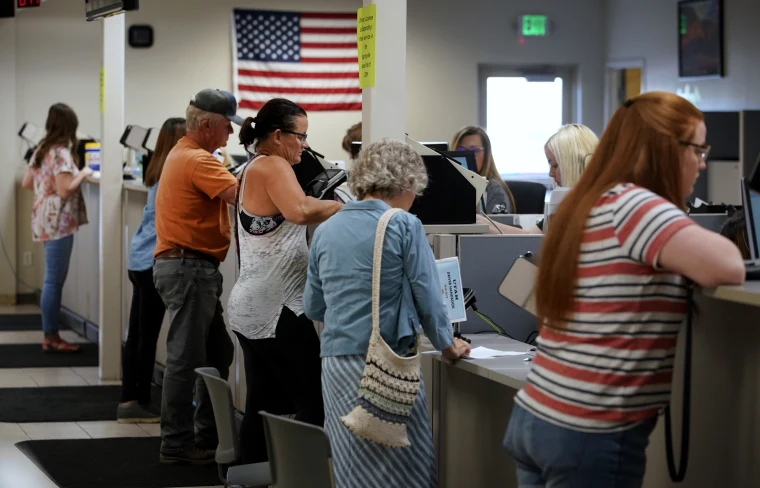

```{r preamble, child = here::here('preamble.Rmd')}
```

---
# Outline 

- About me 

- About This Class

- Working Definition of Government 

???
Today will be pretty light we are just going to go over some of the very very basics of the class. A bit about me and what not. Than hopefully we will get out of here pretty quickly. Just
a few notes if there is a nickname or name that you go by that isn't on the official 
role than just email me I'll put it into my little spreadsheet. If you have 
any trouble with reading the slides or the viz than also email me.
---


---
class: center, middle,  inverse
# About Me 

---

---
# What to Call Me

.panelset[
.panel[.panel-name[Josh Allen]
<center>
```{r, echo = FALSE}

knitr::include_graphics("images-all/josh_allen_bills.png")

```
</center>
]

.panel[.panel-name[Mr Allen]
<center>
```{r, echo = FALSE}


knitr::include_graphics("images-all/Tim_allen.jpg")

```
</center>
]

.panel[.panel-name[Professor Allen]
<center>
```{r echo = F, out.width= "40%"}

knitr::include_graphics("images-all/me.png")

```
</center>
]
]

???
As Logan and several employees at various restaurants have pointed out I am not in fact the QB for the Buffalo Bills. Am I a Bills fan? no a resounding no. Much to the chagrain of Mr Allen I am a niners fan. Mom won that battle. It has not stopped Bills fans from lobbying me to be a bills fan. Some Bills fans have actually asked for proof that I am named Josh Allen despite me being older than him therefore having the name first. I am also not the Jacksonville Jaguars defensive end.  

So if you thought a pro bowl QB was teaching this than I think we should have a conversation about managing expectations. 


I mean if we are going to be honest I probably will respond to various versions of my name. But, I would prefer Professor Allen for a variety of reasons. I will get a little grumpy if you start calling me Mr. Allen because while the age gap between 18 and 27 may seem massive. I am in fact not my father. 

---


---
## About Me 

.pull-left[
### Professional Stuff
- I am a $4^{th}$ Year PhD Student in the Political Science Department

- I am a Research Data Services Graduate Research Assistant,

- Research Interests: Political Legacies of Repression and Political violence

- Grade: 24?

- Number of Times I have taught this class: 3 

- Number of Times I have taught this class in person: 2]

--

.pull-right[
### Personal Stuff  
- Makes Graphs for Fun

- Bay Area Expat

- Walk up song: Temple by Baauer 

- Generally can be found at a gym, my couch, or at the dog park with my dog Melonie in my off time
]

???
This is my second time teaching this class so hopefully there will be less kinks than last year.  I have been in school for longer than some way have you been alive. My research interests are focused on the enduring legacy of violence. Outside of class you will generally find me in like three or four places
---


---

# Dog Pictures


.pull-left[

```{r echo = F, out.width="90%"}
knitr::include_graphics("images-all/melon.png")
```


]

.pull-right[

```{r echo = F, out.width="90%"}
knitr::include_graphics("images-all/melon_uno.png")
```


]


???
I have like a million pictures of my dog. These were from like a month ago. I will sprinkle in dog pictures whenever possible. So on the right there is the Melonie. On the right you have the melonie and one of her boyfriends. 
---

---

class: center, middle,  inverse
# About the class 

---

---
# ~~Office~~ Student Hours

<center>

<iframe src="https://player.vimeo.com/video/270014784?h=2a3d2ca561" width="640" height="360" frameborder="0" allow="autoplay; fullscreen; picture-in-picture" allowfullscreen></iframe>
<p><a href="https://vimeo.com/270014784">What are Office Hours? - by Andrew Ishak</a> from <a href="https://vimeo.com/andrewishak">Andrew Ishak</a> on <a href="https://vimeo.com">Vimeo</a>.</p>

</center>

---


---
# Where are the Slides?

- The slides live on this website [https://fpols110122.netlify.app/talk/](https://fpols110122.netlify.app/talk/)

- Practically the HTML version of the slides are gonna be the ones I use in class. 

- The PDF versions of the slides will just be there for you guys to take notes on if you would like. 
  - Note: I will try and do a better job at this. 

- These slides were made using the programming language `R` with the [`xaringan` package](https://slides.yihui.org/xaringan/#1)

- If you are curious about how they are made just visit [`r icons::fontawesome("github")`](https://github.com/joshuafayallen/fall-22-pols1101/tree/master/static/slides)

???
Without getting into the the technical stuff to much basically each of the presentations are there own self contained webpage. The only difference between the HTML and PDF versions are going to be that some of the media and gifs are not gonna show up. 

Outside of asking for help with this class. Additionally I am research data services gra. Specifically for you I will be running the R workshops. So please check that out if you have any interst or have to do it for a class. 


---

---
# Exam Dates and Top Hat Due Dates

```{r echo = FALSE}

tues <- ymd(20220822)


advdate <- function(obj, adv) {
 tmon <- obj + 7*(adv-1)
 tsun <- obj + 6 + 7*(adv-1)
 tmon <- format(tmon, format="%m/%d")
 tsun <- format(tsun, format="%m/%d")
 zadv <- sprintf("%02d", adv)
 tmp <- paste("Week ",zadv,sep='',", ", tmon," - ",tsun)
 return(tmp)
}

```


- *Exam 1* `r advdate(tues, 5)`


- *Exam 2* `r advdate(tues,11)`


- *Exam 3* `r advdate(tues,16)`


- Exams will be taken online you have until *Sunday at 11:59 pm* to complete the exam
  - Plan accordingly for Exam 2
  
- *Top Hat assignments are due 11:59 on Sundays of that week*

???
These next two slides are basically like the tl;dr of the syllabus. I am really not wedded to having exams online. I figured that since this class is so early that it might be beneficial to have the exams online. 
---

---

```{r echo=FALSE, out.width= "90%"}


```


---


---
## Grading Summary


```{r echo = F}
grades_df = tribble(~Assignment, ~Weight,
                      "Highest Exam Score", "20%",
                      "Second Highest Exam Score", "14%",
                      "Lowest Exam Score", "8%",
                      "Top Hat Readings and Question Probes", "25%",
                      "Activities", "25%",
                      "Syllabus Quiz, Surveys, and Core Assesment", "8%")

gt(grades_df) |> 
  gtExtras::gt_theme_guardian()

```

???
So if you look at the breakdown of the class half of your grade is going to be determined by the Top hat assignments. So please do them and read carefully. You will have three attempts for the content based questions. For polls and opinion questions please answer them thoughtfully. If you do one sentence on them than I will dock some points. I will incorporate them the best I can throughout the class. By that I mean I will pickup the general theme of them and try to address them accordingly.


---

---
## How to Do Well in This Class

- Do the reading

- Take good notes

- Ask questions when you do not understand something

- Participate

???
I know what you are thinking. "No shit professor Allen" and you know fair.
I tend to take the view that this class is more about you guys understanding the 
mechanics of politics. What I see the role of this class is for y'all to develop
skills that you will use a lot. Mostly how to collaborate with peers and learning
to ask for help when you do not understand something. This takes lots of practice.
But they are ultimately things you will use a lot. Lots of things in your professional
career are basically like large group projects. Free-riding in this case will have
consequences. So practice being a good teammate now because there are like next
to zero costs.
---

---
class: inverse, center, middle 
# Break Time 


```{r, echo=FALSE}
countdown::countdown(minutes = 5, play_sound = TRUE)
```

---


---
class: section, center, middle, inverse

# Stuff You Will be Tested On

---

---
## What is a Government and What Does it Do?


???
Obviously as a Pols PhD student this could be a much longer conversation and has been the subject of a lot of study but let us wrap it up in a concise little definition and get outta here
---


---

class: center, left
# What are Governments and What Do they Do?

.pull-left[

```{r, echo=FALSE}

```

]

.pull-right[
```{r echo = FALSE}

```

]

???
Typically we think of government as focused within these individuals. Which is fair we see these people all the time in their various capacities. We know their names and every 2, 4, or 6 years they are on tv 24/7 asking to be re-elected 
---

---
## However, Consider This

```{r echo = FALSE, warning=FALSE, message=FALSE}
pacman::p_load("here", "gameofthrones", 
               "scico")

clean_list = read_csv("majors.csv", skip = 14)

plot_data  = clean_list %>%
  rename(major = Major) %>%
  group_by(major) %>% 
  summarise(total = n()) %>% 
  arrange(desc(total)) 


most_freq = plot_data %>% 
  slice(1:14)


least_freq = plot_data %>% 
  slice(15:28)

 


```

```{r, echo=FALSE}
ggplot(most_freq, aes(x = total, y = fct_reorder(major,total),
                                   color = major)) +
  geom_pointrange(aes(xmin = 0, xmax = total), fatten = 5) + 
  labs(x = "Total", y = NULL, title = "") +
  guides(color = "none") +
  scale_color_scico_d(palette = "vikO") +
  theme_allen_minimal()
```


---

---
layout: false 


```{r, echo=FALSE}
ggplot(least_freq, aes(x = total, y = fct_reorder(major,total),
                                   color = major)) +
  geom_pointrange(aes(xmin = 0, xmax = total), fatten = 5) + 
  labs(x = "Total", y = NULL, title = "") +
  guides(color = "none") +
  scale_color_scico_d(palette = "vikO") +
  theme_allen_minimal()
```

???
As is the nature of an intro class like this the bulk of you are not political science majors. Let us start to consider how you all will interact with government in your professional lives. Get in groups of like 3 or 4 and start brainstorming ways in which the government has a hand in these areas. TIf you don't know your colleague that you are working with. Introduce yourself. As an icebreaker you can choose one of these icebreakers

---


---

## Activity Time 


- What is something you would do that would slightly inconvenience an enemy

- What is a hot take you have 
```{r, echo=FALSE}
countdown::countdown(minutes = 5, play_sound = TRUE)
```

---


---
class: center, right

## Government 

.pull-left[
```{r, echo= FALSE}



```

]

.pull-right[
```{r echo = FALSE}


```


]
???
Government extends to lots and lots of stuff that you may or may not think about. Whether it be zoning, permitting, in some cases what policies universities can and cannot enact. Government pretty much touches everything.


---

## Defintion of Government
### Textbook's Definition
.vero-red[A Set of institutions that]

1. Endure overtime 
--

2. Has **authority over the people** of a specific territory
--

3. Authoritatively **makes and enforces laws**

???
The textbook defines government like this. This is version 2 of the textbook so I saw a bit how the sausage gets made. Government is defined by a set of institutons 
---


---

## A Common Defintion


.pull-left[ 
### Long Version

we have to say that a state is a human community that (successfully) claims the monopoly of the legitimate use of physical force within a given territory...... Specifically, at the present time, the right to use physical force is ascribed to other institutions or to individuals only to the extent to which the state permits it..... Hence, 'politics' for us means striving to share power or
striving to influence the distribution of power, either among states or among groups within a state
]

--
.pull-right[

### TL;DR
we have to say that a state is a human community that (successfully) claims the monopoly of the legitimate use of physical force within a given territory
]

???
So the most common way we start to understand the state in Political Science is with this old dead white guy named Max Weber. He was a fellow writing in the late 19th century. He defines the state this way. 

In Weber the state is distinctive from all other kinds of rule making organizations because of their ability to use violence. 

can anybody think of any other rule making organizations? 
---


---

## Why is the Book's Definition longer?


--

- The minimalist aspect of it

--

- the overemphasis of the coercive aspects of government 

--

- Federalism

--

- Popular Sovereignty 

???
 But what you need to know is that the book has lots of opinions. Most of which I kind of disagree with The Federalism thing is also technically wrong because Weber says that other things can use force if and only if the state delegates them that authority.
 
 The reason it takes issue with this is that under federalism there are lots of "competing authorities. The book also makes the point that highest authority aka sovereignty resides in the people. And that there is an inherent tension between the government and the people in this arrangement 
---


---

## Why is Weber so Popular

What makes the state so special?

--

Think about other rule making organizations

--

The state is one among many in some respect (Midgal 1988, Spruyt 1996)


--

The definition is minimal

???
According Weber and many the most basic function of the state is to dominate other 
social organizations. 

In Weber he does not distinguish states by their ends but by their means. There are lots of rules making organizations that we interact with. Most if not all of them have similar policy goals that make it difficult to seperate them from the state in this respect. 

They can use their rules to enforce monetary punishment. They can also use financial incentives to get people to comply

However, how they can achieve this goal differs. The legitimate use of force according to Weber is what differentiates the state  Legitimation can come through many forms one is domination, using the power of a leaders' convincing, and through rational legal structure The state is the sole authority to use violence to enforce  their rules. The PTA, GSU student gov, etc cannot use violence to enforce those rules It would be pretty jarring if the GSU student government used Violence to uphold its bylaws.


---

---
class: center, middle 


 

---


