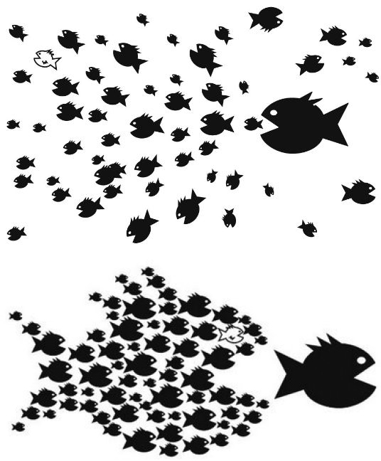
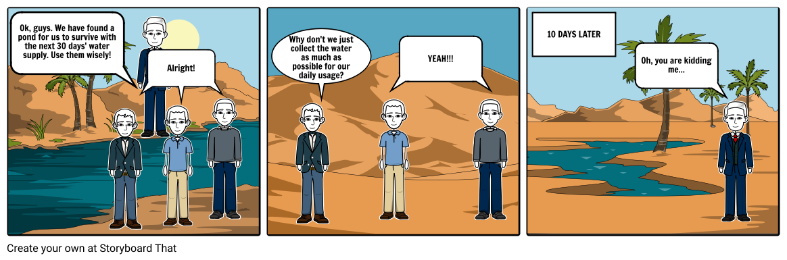
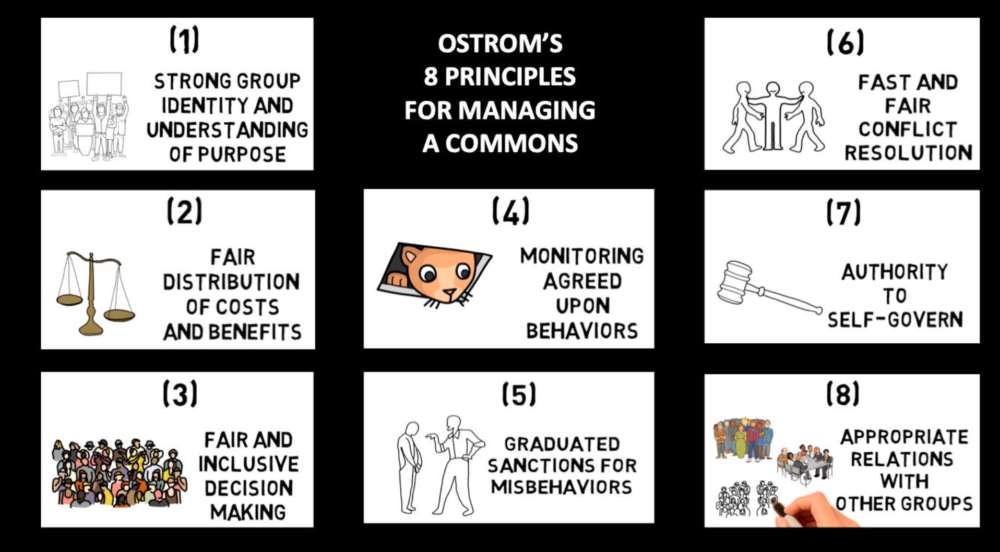
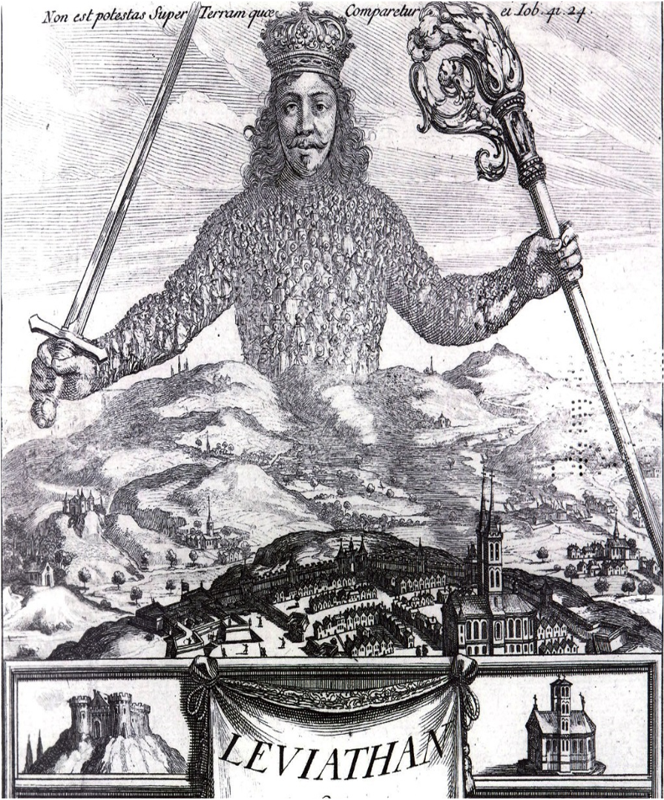

```{r preamble, child=here::here("preamble.Rmd")}
```


---
class: center, middle, inverse

# What is the Point of Government?


---


---
## The Game

- If **all** of you choose to collude then the entire class gets **10 bonus points**  points added to their lowest exam score

--

- If everyone chooses to collude, **but if one person defects**, that person gets **50 bonus points** added to their lowest exam score, and not other student gets any points

--

- If **more than one person** chooses to defect, no student receives any bonus points.

- These are real points 

- [Go to Top Hat to do this and click on poll under week 1](https://app.tophat.com/e/522414)


???
There is no catch all you have to do is play. Monitor the situation however you 
want. 

Hopefully this works. 

this your backup qualtrics link

https://gsu.qualtrics.com/jfe/form/SV_0SZHQU7HhAqWcg6
---


---

## The Collective Action Problem


.pull-left[ 
```{r echo = FALSE, out.width= "80%"}

```


]


.pull.right[

multiple individuals would benefit from a certain action, but this action has a cost that makes it implausible that any individual can or will undertake and solve it alone -
`r tufte::quote_footer("Olson in The Logic of Collective Action: Public Goods and the Theory of Groups(1965)")`


]


???


The prisoners dilemma sets up nicely to talk about the role of government. Classically 
the game is setup where two people are being questioned about a crime in seperate room.
The suspects can either cooperate with each other and not say anything and be set free.
One can confess and be set free and the other is sent to jail. They can both confess
and both go to jail. This stylized game highlights when people incur costs themselves
cooperation is hard. If you watch football then this was brought up endlessly in 
the Raiders Chargers game. If I am remembering correctly there was also a prisioners dilemma
in Survivor 


The collective action problem is kind of a scaled up version of this.
The personal costs that people incur make it difficult for people to get the group benefit.  

These costs differ from person to person. 

This is sort of an interesting idea because the classical liberal view of the free market is that the pursuit of self interest leads to the collective good.
---

---

## Enter Government

- Cooperation is hard as we have seen 

--

- To entice people to cooperate we have to offer people selective incentives

- This is where government comes in 


---

---
# Selective Incentives

## What Are They?


.pull-left[
### Negative (Sticks)

- Fines

- Imprisonement
]

.pull-right[
### Positive (Carrots)

- Payements

- tax credits


]

???

selective incentive are  specific benefits extended to the individual conditional on a contribution

So the way you will most often hear about this is through carrots and sticks.
This comes from how you bribe a stubborn horse to move. You can either get it 
to move by dangling a carrot in front of it or you can hit it with a stick. Essentially you are trying to penalize non-cooperation

The book states them in terms of the power of the purse and the power of the sword. 

Affecting the hearts and minds of people can kind of go in either way. You can play up the sense of civic duty and sense of pulling in the same direction. Others can try and shame people into compliance. During WWI Admiral Fitzgerald recruited 40 British Woman to start handing out or mailing out white feathers to unenlisted men in the military. At that time white feathers were a symbol of cowardice largely a convention based in cockfighting during the 19th century.
---


---
## Get to the Point

- Governments, and the goal of collective action, ultimately provide what are known as public goods 

- Public Goods have two components 

  1. Non-Rivalrious
  
  2. Non-Excludable
  
???
Non-Rivalrious basically means my consumption of the good does not reduce the supply of the good
so there is equal supply for everybody. 

Non-excludable is the part of the definition that is straightforward it just means
everybody can consume the good 

Public goods are very expensive difficult to provide,
and are to costly for private actors to provide. The reason why this is occur is that we are making the prisoners dilemma iterated. In a iterated prisoners dilemma what happens is if its played over and over again you can start to credibly punish people. 

So how do we get public goods? The government steps in. Unlike a private firm, the government has no profit motive. And the government reduces the free rider problem by collecting taxes from consumers to help fund public goods. You could think of it this way: The government simply returns the public’s own money to them in the form of public goods.
---
## Problems 
### Free Riding 

- It would be pretty great to benefit from stuff without paying for it, right?

- Paying taxes is not fun for anybody

- This results in what are known as a market failure

- .vero-red[Market Failure]: is the economic situation defined by an inefficient distribution of goods and services in the free market. Furthermore, the individual incentives for rational behavior do not lead to rational outcomes for the group.* 

.footnote[*Not going to be tested on this]


???
As is the case in the class the world is complicated and the book tries to distill
an entire graduate class into like a chapter or paragraph. Free riding is the most common problem
that arises in this literature. 

Generally people want to reap as much as possible without
paying into stuff. If this happens at a scale the good will be underprovided, overused, or degraded

Essentially a good is being produced under a condition where there are insufficient resources to produce them. Under these conditions most businesses cannot or will not produce the good 

If a private business supplied a public good, most people would consume the product for free. Since it is nonexcludable and nonrival, consumers can already get the full benefits without paying anything. They won’t likely donate much, if any, of their hard-earned cash. Hence, the company won’t make much money. That’s why private firms won’t produce public goods; there’s no reward. Firms instead spend their time and resources producing private goods because people do have to pay for those, allowing the firm to sell them for a profit.

When a private market fails to produce a good at the level society wants, or doesn’t produce it at all, economists call this a market failure.

---

---
# Problems(cont)
### The Common Pool Problem 


```{r echo=FALSE}



```

???
The tragedy of the commons is a kind problem that arises when the good is rivalrious but non-excludable.
This comes up in environmental politics and economics a lot. In this case an inidividual's consumption decreases the supply and the good is non-excludable

---


---
## What is a Government to Do?

.pull-left[

### Free Riding
- Selective incentives typically of the stick variety

]

.pull-right[

### Tragedy of the Commons

```{r echo = FALSE, out.width= "80%"}



```
]


???
the cop out answer is usually just to make things private goods. But that isn't really an option in most cases so  governments have to get more creative than that. 

Note that there is a lot that 
goes into both of them. Ostrom actually got her Nobel Prize in 2009 for her work on the common pool problem. So this is very much an active research area. Governments have to step into solve these problems. And the tools by which they do that is often tricky. Ostrom demonstrates that it is not as big of an issue and there are often community based solutions

How would a government work to solve this?

regulations on use. quotas etc. 


---
## What Other Kinds of Goods Are There??

- Lots!!
<center>


</center>
???

Essentially the distinction starts to break down quickly. As you start to scale up a public good. You are going to functionally alter one of the two dimensions. Highways during a rush hour are an example 
---


---
# Break Time
```{r echo = FALSE, out.width= "50%"}
knitr::include_graphics("images/melon.png")
```


```{r echo = FALSE}
countdown::countdown(minutes = 5, play_sound = TRUE)
```

---


---
## The Englightenment
Main Ideas: 
- Natural Rights

- the Social Contract

- Legal Rights


???
I found this part to be the least interesting part when I was in your shoes so we are going to fast forward through this. During this time period lots of very smart people like Locke, Rosseeau, Hobbes, etc thought a lot about what the role of government should be why we have it etc. However, the concepts are the basis upon which we get the constitution and the declaration of independence and how we  see the role of American government
---


---
## Hobbes

.pull-left[
```{r echo = FALSE}



```
]

--

.pull-right[

- State of Nature-a state in which self-interest and anarchy prevents society from existing “civilly” 

- Humans would all be “dirty, poor, brutish, and short"


- Social Contract - individuals give up some of their rights so others will give up theirs, and agree to be governed by a state

- "If protection rackets represent organized crime at its smoothest, then war making and state making – quintessential protection rackets with the advantage of legitimacy – qualify as our largest examples of organized crime" Tilly 1985


]

???
They sort of started off in a similar place as you guys did in our little game. What happens 
if there is no government. Well you are pretty much free to do whatever you want. You are totally and completely free. But that means  nothing is off thee table. The strong take what they will and the weak suffer what they must. In essence government serves to alleviate that problem. You incur some short term costs by giving up some of that freedom but in turn you get a public good. Governments in this case provide violence as the one and only public good
---

---
## Locke

.pull-left[

```{r echo = FALSE, out.width= "80%"}


```


]

.pull-right[

Natural rights: rights that are not dependent on any laws or customs of a particular society or government. They are universal and inalienable.

Legal rights – rights that are bestowed upon an individual within any given legal system. They can be modified or removed

.vero-teal[Limited Government]: Principle that holds government must be empowered to serve its legitimate purposes, but it must also be limited and controlled in its powers so that it does not pose an unacceptable threat to the fundamental rights and interests of the governed


]

???
However the framers and other scholars at the time rightly went. That sounds kind of shitty. The easiest way to achieve Hobbes's solution is to invest all the coercive capacity into the "Leviathan" Aka a strong state. However, another central concept is this idea of natural rights. Natural rights are things you are just born with. For the founders this is encapsulated in the Declaration of Independence. 

They highlight the sort of inherent tension between having a strong state and wanting these natural rights. Any government strong enough to uphold these rights is strong enough to violate these rights. We sort of make compromise again but with the caveat that we give up this ultimate freedom so long as the government does not violate our natural rights. We consent to be governed and if we feel the government no longer lives up to their promise we can kick the bums out.

In this sense government should be as small as possible. It must be large enough to extend these protections of property and our natural rights but not big enough to get any ideas 

---


---
## Economic Systems 

### Capitalism

.pull-left[


]


.pull-right[
- Capitalism was an emerging concept during the Enlightenment

- Smith argues that the allocation of the factors of production should be determined
by the "market"

- For **any** good to be produced you need: Land, Labor, and Capital

- Most important Economic actor: the individual

- The Invisible Hand

]
???
Capitalism grows up alongside other enlightenment ideas. Prior to this system Europe had what was known as mercantilism were the main economic actor was the crown. The sole purpose of the economy was to enrich the nation. The power of the state is interconnected very deeply with the wealth of the state. Smith comes along in an age where the focus turns toward the individual. 

He argues that for economies to progress the individual must set off to maximize their personal profit. The pursuit of this profit by every leads to what Smith calls the social good. In the classic liberal economy. The invisible hand is when under perfect factor mobility and perfect competition the market will determine the most efficient allocation of land labor and capital because of supply and demand. 

Sellers want to sell their stuff that benefits them the most. Buyers want to buy stuff at a price that is advantageous to them. Crucially the owners of the factors of the production are private actors rather than the state.

This is like the quickest and dirtiest explanation of Macroeconomics possible. For more thorough explanations you are going to take some classes in our Econ department or with Dr. Hankla. The role of the state in this case is to correct market failures. These arise for various reasons and are altogether pretty common. 

In the American context the role of government is to make sure that the free market is working and the allocation of the factors are done by individuals. The role of the American government in 


---
## Other Economic Systems 
.pull-left[
### State Socialism 
<gsu-blockquote-red>
State socialists believe market capitalism necessarily results in too much economic inequality and in oppressive relationships between workers and the owners of capital. [Part of] the purpose of government is for it to take over ownership of all major parts of the economy and forcefully enact a social revolution that brings about perfect economic equality and the end of all class oppression.
</gsu-blockquote-red>
]

.pull-right[
### Command Economy
<gsu-blockquote-alt>
The state owns and controls most of the factors of production, including
land and capital goods. The state also engages in central planning.
Production of goods and services, as well as their prices and distribution,
are centrally controlled by the state.
</gsu-blockquote-alt>
]


???
We sort of like to charecterize like all the things as state socialism because it has a particular sort of connotation. The book essentially describes what is known as a command economy. State socialism is a particular flavor of a command economy. Where the state determines the allocation of goods and owns all the factors. The sort of difference is the ideological tint that state socialism takes on. The classic example of a command economy is the USSR. State socialism has a particular ideological tint to a command economy. 

---

--- 


## Democratic Socialism

- It's in the news a lot but .gsu-blue[what is it?]

--

<gsu-blockquote-red> Democratic Socialist: Ideology of those on the left-wing of the Democratic Party (and of mainstream American politics), which advocates for a more substantial role by government in promoting equality and other distinctive left values than does center-left liberalism </gsu-blockquote-red>


???
So Marxism arises in the Industrial revolution as a response to capitalism during the Industrial revoloution. The basic tenets of Marx are outlined in Kapital. It is honestly kind of funny book. It is really hard to read but Marx kind of just trails off randomly to rail against the Bourgeiouse clas. Which is basic crux his argument. In Kapital he argued that capital class was exploiting the proletariat to benefit from their labor. While the proletariat was not benefitting from the fruits of their labor. Marx called for the proletariat to take back the means of production (land, labor, and capital). By overthrowing the 


So democratic socialists a faction that broke away from Marxism. They didn't disagree that something needed to change. Conditions in these factories were about as bad as you can imagine. Democratic socialists essentially argued that the role of government is to help deal witth the inequality and working conditions that capitilism caused.

---

---
class: section, center, middle, inverse


# The American Way of Government and How it Differs

---


---
## Regime Types According to VDEM


```{r, echo=FALSE, warning=FALSE, message=FALSE}


pacman::p_load("sf", "ggmap", "wesanderson", "countrycode", 
               "scico", "MetBrewer", "WDI", "vdemdata")

vdem_raw = vdemdata::vdem 


vdem_cleanish = vdem_raw %>% 
  select(v2x_regime, country_name, country_text_id, year) %>% 
  filter(year == "2018") %>% 
  mutate(ISO_A3 = countrycode(country_name, origin = "country.name",
                              destination = "iso3c"),
         regime_type = case_when(v2x_regime == 0 ~ "Full Autocracy",
                                 v2x_regime == 1 ~ "Electoral Autocracy",
                                 v2x_regime == 2 ~ "Electoral Democracy",
                                 v2x_regime == 3 ~ "Liberal Democracy"),
         regime_type = as.factor(regime_type)) %>% 
  arrange(ISO_A3)


world_map  = read_sf("data/ne_110m_admin_0_countries.shp")

world_map_fixed = world_map %>% 
  mutate(ISO_A3 = case_when(
    # If the country name is Norway or France, redo the ISO3 code
    ADMIN == "Norway" ~ "NOR",
    ADMIN == "France" ~ "FRA",
    # Otherwise use the existing ISO3 code
    TRUE ~ ISO_A3)) %>% 
    filter(ISO_A3 != "ATA") 


plot_data_world = left_join(world_map_fixed, vdem_cleanish, wdi_clean, by = "ISO_A3")  


plot_data_world$regime_type = factor(plot_data_world$regime_type,
                                     levels = c("Full Autocracy",
                                                "Electoral Autocracy",
                                                "Electoral Democracy",
                                                 "Liberal Democracy"))


 ggplot() + 
  geom_sf(data = plot_data_world, aes(fill = regime_type),
          color = "#CDCDCD", size = 0.1) +
   coord_sf(crs = st_crs("ESRI:54030")) +
    scale_fill_scico_d(palette = "vik", direction = -1, na.value = "grey80") +
   labs(fill = "Regime Types",
        caption = "Data are derived from the Varities of Democracy Project") +
   theme_void(base_family = "Roboto Condensed") +
   theme(legend.position = "top",
         legend.text = element_text(size = 8),
         plot.caption = element_text(hjust = 0.8))
 


```
???
As somebody who studies comparative politics I get pretty jazzed when we are
talking kinds of government. Purpose of Government etc. So I decided to use data
from two of the most popular measures of regime to color our discussion
---


---
## Lets Break Down VDEM  

.panelset[

.panel[.panel-name[Closed Autocracy]


<gsu-blockquote-red>No multiparty elections for the chief executive or the legislature
</gsu-blockquote-red>


]

.panel[.panel-name[Electoral Autocracy]


<gsu-blockquote-alt>De-jure multiparty elections for the chief executive and the legislature, but failing to achieve that elections are free and fair, or de-facto multiparty, or a minimum level of Dahl’s institutional prerequisites of polyarchy as measured by V-Dem
</gsu-blockquote-alt>


]


.panel[.panel-name[Electoral Democracy]


<gsu-blockquote-alt>De-facto free and fair multiparty elections and a minimum level of Dahl’s institutional prerequisites for polyarchy as measured by V- Dem’s Electoral Democracy Index (v2x_polyarchy), but either access to justice, or transparent law enforcement, or liberal principles of respect for personal liberties, rule of law, and judicial as well as legislative constraints on the executive not satisfied </gsu-blockquote-alt>

]


.panel[.panel-name[Liberal Democracy]


<gsu-blockquote-blue> De-facto free and fair multiparty elections and a minimum level of Dahl’s institutional prerequisites for polyarchy as measured by V-Dem’s are guaranteed as well as access to justice, transparent law enforcement and the liberal principles of respect for personal liberties, rule of law, and judicial as well as legislative constraints on the executive satisfied as measured by V-Dem </gsu-blockquote-blue>


]
]

???
To be fair to the book defining regimes is pretty difficult and the comparative
politics literature still spends a considerable amount of time fighting about
regime classification. The book has a bit of an old school definition of how we think about
regime types in comparative politics. When we think about how we classify different regimes
in the world we should separate the issues that we face. The first is what sorts of stuff
make a regime authoritarian and what stuff makes it a liberal democracy. Then the part
that for this class we are going to set aside is how do we measure that stuff.
---


---
## Polyarchy 
### What is it

1. Freedom of Expression 

--

2. Freedom of Association

--

3. Who chooses our leaders

--

4. That choice is open to all and can unseat those in power

--

5.  People from different backgrounds can be our leaders

--

6. Those making that decision can consume a variety of information to make that choice


???
VDEM embraces what is known as Dahl's polyarchy. In the early days of political science a lot of theorizing went into what we meant by "Democracy" and "Authoritarianism" one of the most prominent of these theories was Dahl's polyarchy. In our sort of folk theories of democracy we these things are fairly intuitive. Liberal democracies do all these things but as citizens are mostly in disagreement about the how they do this and how much leeway they have to do this. But it is very much informed by the Enlightenment. 

Without saying it the book very much sees the U.S. way of government closely adhereing to these principles and its purpose is to protect these things 

---


---

## How Do Authoritarian Leaders Exit

```{r echo = FALSE}
svolik_raw  = haven::read_dta("data/leadership change in dictatorships, 1946-2008.dta")

 svolik_raw %>% 
  group_by(exit) %>% 
  summarise(total = n()) %>% 
  ungroup() %>% 
  filter(!exit == "." ) %>% 
  mutate(exit = str_to_title(exit),
         exit = factor(exit),
         flag = ifelse(exit == "Revolt" | exit == "Civil War", TRUE, FALSE)) %>% 
  ggplot(. , aes(x = total, y = fct_reorder(exit, total), fill = flag )) +
  geom_col() + 
  geom_text(aes(label = total), nudge_x = -8 , color = "white" ) +
  scale_fill_manual(values = c("grey70", "#f2ad22")) +
  theme_allen_minimal()  +
  labs(y = NULL, x = "Number of Authoritarian Exits") +
  guides(fill = "none")

```


???
Our folk theorem of democracy and authoritarianism a bit misguided. The book views authoritarian politics through the lens of "what is the recourse for the people." A more informative approach is figuring out who matters in these systems. 

The book sort of argues that the institutions in authoritarian regimes are "window dressing."  However, this is not entirely helpful. If we take the view that the book does that is not unfair. Think about this graph. I have highlighted the things we typically think of the people participating in. But notice that the bulk of exits happen because of things that happen between elite actors. 

Institutions in all regimes structure the interactions of individual actors. they constrain the choices available to each actor and good ones endure across generations. The sort of distinction that VDEM makes between kinds of authoritarian regimes who is allowed to compete. Authortarian regimes have elections all the time. Elections have various functions in authoritarian regimes. Whether they are gathering information about the opposition. Performance of various ministers and how they are distributing patronage. This is sort of my rant about the book

However what i think is critical and will be reocurring is that the behavior of individuals is one thing we will talk about, but we also must understand what institutions do and how they reinforce the rules of the game.


---

---

class: section, center, middle, inverse


.col[
# The American Way of Government
]

# AFLD (American Flavored Liberal Democracy)

---


---
## Democracy

.pull-left[
<gsu-blockquote-blue> Direct Democracy: “pure” democracy - one in which the people make the decisions in the manner in which political powers should be exercised. </gsu-blockquote-blue>
]

.pull-right[
<gsu-blockquote-red> 
Representative democracy – where the authority of the governments lies with the people (the electorate) that elect representatives to support their interests

</gsu-blockquote-red> 

]

???
Direct democracy is the original form of democracy. Democracy like 0.1 or raw dogging democracy. There is an important distinction between direct democracy and 
representative democracy. 

The key distinction is that we delegate some our power to our elected officials. We will talk about this more later on, but this is essentially a principal-agent problem. For direct democracy you gotta determine like all the things. If any of you have ever voted at like the end of your ballot you have various things like "Do you want to enact this tax? It pays for schools" You cast your ballot and then boom its law. Just start expanding it out more. As a Californian we have a lot of these. Sometimes they are kind of innocuous like every election cycle somebody tries to get CA seceding on the ballot. Other times civil rights like Gay marriage are put on the ballot. I was like little when this happened. I dont know if this will be brought up in the Civil Rights/Civil Libertis weeks. But Prop 8 was defeated and gay marriage was not legalized in CA. But Prop 8 was crafted to be as like confusing as possible, but with the end goal of homophobia

---


---
## Constitutional Democracy
.pull-left[
<center>
<gsu-blockquote-alt>


Governments, like the United States, that are effectively bound by fundamental laws are called “constitutional governments.”


</gsu-blockquote-alt>
</center>
]

.pull-right[

- **Rule of Law**: The idea that **all** citizens, **including government officials**, are bound by laws

- **Fundamental law**: The federal government is bound by the laws declared in the Constitution. If a statute is in conflict with the law of the constitution, then the statute is considered unlawful. ] 

???
In particular the American flavor of Liberal democracy is all about the our Constitution. In other liberal democracies interpretation of the founding documents is less of a thing. In some cases like in England there is an informal Constitution but not like a piece of paper you can go see in the national archive. The idea of rule of law is sort of intuitive regardless and that is everybody is bound to the same laws.


Put another way. Me and Joe Biden can both go shop lift stuff. If we get caught stealing shit we will both be prosecuted by the law. Fundamental law is just the idea that no basic ass laws are higher can take precedence over the constitution. The book uses establishing an official religion as an example. It is in clear conflict with the first amendment's establishment clause. 


However, if a state decides to say fuck it and makes WAP, All to Well(Taylor's Version), or something else as their official state anthem over the star spangled banner their is no conflict between fundamental and ordidnary law because the constitution doesnt say anything about an official song.


---
## Role of Government 

- What it provides

- What it ignores

- How it provides


???
So we went over a lot of stuff in this class. What I think it is important to takeaway is that cooperation is hard and governments are supposed to help us cooperate at a minimum. If we think back to the first class remember that the minimal definintion of government is that it has the monopoly over the use of force. The use of coercion is the basic public good that every government must provide. In the American Liberal Democracy we frequently debate about how and what stuff the government provides. A central insight is that an entity strong enough to secure these contracts has the ability to violate our rights. Much of the political discourse in our country has been about how big or small the government should be.
---


