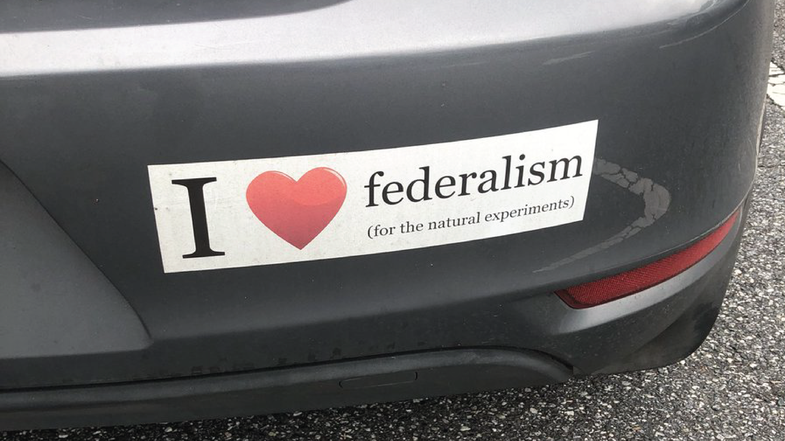

```{r preamble, child = here::here('preamble.Rmd')}
```


---
class: center, middle, inverse

.col[# Federalism]

--
.col[# Experiments Everywhere]

---


---

layout:false 


```{r, fig.align='center'}

```


???
Modern applied economists love federalism because of states make policy that allow them to talk about how policy causes certain outcomes. One of the economists that won this years noble prize in economics wrote a very influential paper on the effect of minimum wage because New Jersey increased minimum wage in 1992. However we for quite a while we have referred to states as laboratories of democracy. This was a term coined by Walter Brandeis and has stuck. Federalism allows states to implement various public policy. Theoretically efficient policies enacted by one state will lead to staggered adoption by other states while inefficient policies will not be enacted by other states 


As one of your colleagues pointed out last week concealed carry permits in some states are not recognized by some states. This is essentially a licensing issues. While all states recognize marriage licenses and driver licenses these differ in critical ways. For drivers licenses in all states you have to meet a similar minimum safety standard. 

To the contrary, concealed carry standards vary dramatically across the country — including on gun safety training, disqualifying violent criminal convictions, and even the requirement to get a permit at all.

For example, 23 states allow concealed carry by many people with violent misdemeanor convictions, 19 states don’t require firearm safety training, and twelve states don’t require a permit at all

Some states have concealed carry reciprocity. However this varies which makes it a tricky one to one comparison. 


---


---
## What is it?  

```{r}
vembedr::embed_url("https://www.youtube.com/watch?v=J0gosGXSgsI&t=5s")

```


???
(9:13)
---


---
## Federalism and Beer

- CALIFORNIA: Homebrewers cannot exceed 100 gallons of beer

- UTAH: Beer >5% ABV can only be sold in state stores.

- ALABAMA: Beer stronger than 13.9% ABV is not permitted.

- FLORIDA: No bottles larger than 32 ounces.

- GEORGIA: 14% ABV cap on beer.

- INDIANA: Prohibits the sale of cold beer

- KENTUCKY: Malt beverages may be sold at any establishment with a liquor license.  Wine and liquor may only be sold in liquor stores, which require an independent  entrance.

- OKLAHOMA: Beer stronger than 4% ABV can only be sold at room temperature.

- KANSAS: Many counties require restaurants to earn at least 30% of profits from food - in order to sell alcohol

- NEW YORK: Beer and liquor cannot be sold at the same store.


???

Alcohol is perhaps an easy example.

For fun lets pair up and see what weird state laws you can come up with. I assure you there are many 


---

---
## Who Governs

- 87,576 governments within the United States Federal System

  - 1 National Government 
  
  - 50 State Governments
  
  - 3,034 County Governments
  
  - 19,429 Municipalities 

  - 16,504 Townships
  
  - 13,506 School Districts
  
  - 35,052 Special Districts
---


---
## Federalism 

<gsu-blockquote-blue> 

  is a principle of government that means authority is partly divided and partly shared between the federal (aka “central” or “national”) government and the state governments </gsu-blockquote-blue>

???
Can someone tell me how sovereignty relates to federalism?
Federalism means that states relinquish some of their sovereignty to the federal government. Similarly, the federal government also relinquishes its sovereignty to the states. They share authority and power.

---


---
## How is it Different 

.pull-left[
### Federalism 

- A system of power in which power is divided, by a Constitution, between local, state, and federal governments 

- promotes individual attention 


]

.pull-right[ ### Alternatives

- **Unitary System**: A centralized government system in which lower levels have little power or autonomy from central government

- **Confederacy**: Authority is held by individual states, and powers are delegated to the central government sparingly 

]

???
Think about your neighborhood. What is one thing that you feel that you need from the government that other neighborhoods may not need/want? How are you going to get them to change that? 

In a unitary system you would have to rely on the change occurring slowly and as a order from the centralized government. The local townships and such are limited in the amount of power that they can wield to make actual change. 

In a confederation you would rely on the state governments which while maybe effective will also differ from state to state. Say you want a pothole filled on the street. One state may decide to fill the hole with actual asphalt solving your problem, but another state may just decide to fill the hole with sand. The protections or coverage vary from state to state thus making it difficult for uniformity. Who can think of the most widespread example of federalism we have in the US? It is currently limiting where the Offensive Coordinator of the 49ers will interview for jobs


---

---
## Benefits and Weaknesses 

.pull-left[
### Greater National Authority
Preserves the union

Reduces compliance costs

Provides national public goods & reduce negative externalities

Protects minority rights

Prevents races to the bottom

]

.pull-right[
### Greater State Authority
Protects liberty

Represents local diversity

Allows for policy experimentation

Benefits from foot voting

Fosters democratic citizenship


]

???
There are kind of two competing visions for what kind of union we benefit most from with adovcates from both sides


preserving the union 

According to this argument, when states are allowed to have too much independent authority and power, they can threaten the stability of the union. Since the union is the basis of peace, prosperity, cooperation, and so on, it follows that a strong national government (and weaker, subordinated states) is necessary for attaining all of those benefits.


Generally speaking, uniform national rules and standards reduce the opportunity costs associated with complying with government laws and regulations. Consequently, an argument made for greater national government authority is that the national government is best positioned to create these uniform national rules and standards and, thus, to provide the benefit of reduced compliance costs.


public goods and reduce negative externalities:

Proponents of a strong national government contend that the national government is more likely than state governments to identify and provide nationwide public goods. The states, according to this argument, are too limited in their views and/or too selfish in their motives to overcome the temptation to free ride.


Similarly, due to shortsightedness and/or selfishness, states are often tempted to impose costs and risks on other states. Pollution is a good example of a negative externality. In economics, externalities are a cost or benefit that is imposed onto a third party that is not incorporated into the final cost. If you pollute a ton by just dumping waste into a river or run really cheap but dirty production your costs are going to be lower and you don't have to charge your customers for it but it is not really 


preventing races to the bottom 

When economic competition between states leads them to try to outdo one another by enacting socially suboptimal regulations to attract or retain businesses investment, the competition is called a race to the bottom. In the United States, a common argument for the national government playing a leading role in regulating large corporations is that it can uphold higher standards than the states can due to its not being caught up in the interstate competition that leads to races to the bottom.

However this is not always the case. Imagine that the states are pseudo countries for a second and you are a car manufactuarer. Does it make sense to make cars that meet the minnimum regulatory standard of each and every state? What about the minimum regulatory standard for a hypothetical state that does not have any requirements that a car has a functioning air bag system or a seatbelt? 

arguments for greater state authority 

protecting liberty. the national government would need to develop the capacity to enforce all of the laws that are currently enforced by state and local governments. This would require the creation of a massive federal executive branch of government that stretches out all over the country.


if state governments do not retain a certain amount of independence and autonomy, then they cannot serve as a check on the power and influence of the national government. Without state governments serving as a check on the national government’s power, the argument goes, the national government will dominate the people and strip them of their freedom

diverstiyt arugment 

According to this argument, since there is much diversity in values and interests throughout the country, it can be better to allow decisions to be made at the most local level possible.


foot voting 


If individuals or businesses dislike the package of policies enacted by their state or city governments, they can “vote with their feet” by moving to states or cities with policies they find more acceptable. Even better, the argument goes, the mere possibility that people and businesses might relocate can serve as a powerful deterrent against state governments enacting unjust or inefficient public policies in the first place


---


---
## Races to the Bottom

```{r }

vembedr::embed_url("https://youtu.be/3XE5m_meLVw?t=81")

```


---


---
## Who Has Authority Over What?

```{r, echo=FALSE}

pacman::p_load("ggwordcloud")

words = read_csv("data/federalism.csv")


ggplot(words,aes(label = word)) + 
  geom_text_wordcloud() + 
  theme_minimal()


```
???
Answers: 
Money – National 

Issue Licenses – State 

Highways – Concurrent 

Conduct Elections – State

Regulate Commerce – Concurrent

Borrow Money – Concurrent

Establish A and N – National 

Establish Treaties – National 

Establish P,F, and EM depts. – State 

Collect Taxes – Concurrent 

Declare War – National 

Regulate the Post Office – National 


---

---
## State Powers 

- Regulating economic activities with no relation to, or affect on, commerce outside the states

- Creating public schools 

- Family Law

- Regulating and facilitating elections

- Issuing Licenses for hunting, driving, operating businesses 

- Traffic Regulations 

- Designing and staffing state court system 

- Promoting health, safety, welfare, and morality through powers not delegated to the federal government 
---


---
## Federal Powers

- Taxing imports and exports

- Diplomacy and treaty making 

- declaring and fighting wars 

- Recruiting and equipping the armed forces

- Regulating interstate commerce 

- Coining money 

- Making and enforcing immigration laws 

- issuing patents and copyrights

- designing and staffing the federal court systems 


---


---
## Concurrent Authority 

- Taxing, income, goods, services, and land 


- using the power of the purse to promote the general welfare 

- borrowing money 

- establishing banks 

- building roads 

- regulation of economic activities within a state that have a relation to, or affect on, commerce among two or more states 

???
Concurrent powers

---

---
## What about The Supremacy Clause? 

<center> 
<gsu-blockquote-red>
“This Constitution, and the Laws of the United States which shall be made in pursuance thereof; and all treaties made, or which shall be made, under the authority of the United States, shall be the supreme law of the land; and the judges in every state shall be bound thereby, anything in the constitution or laws of any state to the contrary notwithstanding” 


</gsu-blockquote-red>

</center>

???
If there is going to be one thing you take away from todays class it is going to be the crucial nature of the Supremacy Clause.  Found in Article 6, Clause 2 it establishes the Supreme law of the land for everyone. It binds all of us, from the individual citizen all the way up through the top tiers of government to the highest law in the land, the Constitution.  It was essentially a fail safe put in place by the Founders to ensure that the national government could execute its job fully. 

---

---
## Two Supreme Court Constitutional Doctrines Essential to American Federalism
### Other Than the 10th Amendment

- Dillon's Rule 

- Police Power

???
Dillon's Rule: It subordinates municipal level governmnts 

county) governments are fully subordinate to the will of state legislatures. This means state legislatures have complete authority to create, destroy, and alter the geographic boundaries and legal powers of all municipal governments within the state’s jurisdiction. And municipal governments are said to only have the powers that are clearly and explicitly granted to them by state legislatures

Police Power: States may enact any law with the aim of promoting the health, safety, welfare, and morals of the people unless the law violates a limit on the states’ authority provided in the U.S. Constitution or their state constitution. The limits of state police power has been in a constant push and pull with the federal government 


 the states are not limited to the powers delegated to them in their constitutions. Instead, so long as states do not violate a legal limit placed on them by the U.S. Constitution or their state constitutions, the states may do whatever they choose to promote the health, safety, welfare, and morals of the people


Critically the Supreme court has interpreted the 10th amendment as only giving states police power
---


---
class: center, middle 

## The Evolution of Federalism


```{r echo=FALSE}

knitr::include_graphics("images/cake.jpg")


```

???
Dual Federalism – Layer Cake – the view of federalism in which the national government is limited to a strict interpretation of the powers granted in the constitution while states have a broader  policy power within their own territories.  Clear concise lines between the two national and state. “States rights”  

This thought dominated the first 150 years of American history. It was a period characterized by strong actions of the Supreme Court against national power especially when it came to regulating commerce. It wasn’t till the 1930’s and the New Deal that things began to change. 


Specifically, nearly every time during this period when the federal government attempted to regulate activities related to economic production—for example, workplace safety, wages, working hours, and so on—the Court declared the regulation unconstitutional. According to the Supreme Court at the time, the Constitution delegated to Congress authority to regulate interstate commerce but not economic production. Since economic production is local and, therefore, not in itself a part of interstate commerce, the regulation of economic production is a power reserved exclusively to the states


Cooperative Federalism –  Marble Cake – a  view on federalism in which the national government expands its powers and blurs the lines between national and state authority. The new deal opened many doors between the roles to state and federal government, mostly giving the national government a long needed boost in support and power. This time is also characterized by protection of minority rights (Child labor laws, women working laws, and eventually Civil Rights Legislation). 

---


---
## What Drives Changes in Power Between the Federal and State Governments 

- Crises (Civil War, Great Depression, 9/11)

- Technology 

- Politics 

- The Supreme Court


???

Crises: Great depression led to many increases in the power of the federal government into the realm of financing and the economy
9/11 created large bureaucracies to secure the country, but this meant a large growth in the power of the federal government

The internet now means that I can sit in my office and order fuzzy socks from Oregon.  This now means that there is commerce from other states, and now Congress can pass legislation that regulates that commerce (minimum wage, workplace safety, etc)

Politics In general Dems support a larger role for the federal government Repubs are the opposite

Supreme Court We will see in the next 3 slides

---

---
## Dual Federalism 

- "Layer Cake" Federalism 

- Two systems working independently from one another 

- The system of government that dominated the US for the first 150 years in which the powers were shared equally between the two levels of government, state and federal

???
Under dual federalism, states tended to dominate most aspects of American government.

For ex:  State legislatures were actively involved in economic regulation (also regulated the practice of important professions such as law and medicine).

The national government focused primarily on the promotion of commerce, leaving most 
other government functions to the states.

In addition, book points out that none of the government’s policies directly coerced citizens.  The emphasis of government programs was on assistance, promotion, and encouragement—the allocation of land or capital where they were insufficiently available for economic development.


Key point:  most of fundamental governing in this country was done by the states during this time.  State and national governments were also performing highly different functions (like a “layer cake”).

This arrangement is basically what was intended by the framers (recall they wanted to limit the power of the central government). 

Arrangement had some benefits:  by making the national government small, they were able to keep it out of divisive issues of the day (such as slavery

---

---
## McCullough v. Maryland (1819)


- Dual Federalism and the dominance of the federal government 

--

- SUPREMACY CLAUSE meets the NECESSARY AND PROPER CLAUSE 

???
McCullough v. Maryland – The US decided to charter a bank and open branches in several states including Maryland. At the time, a variety of thoughts were running rampant through the states about government corruption and scandal. The quickest way to corruption and scandal was concerning issues of money. Placing money in a bank provided no guarantees and only further scared those individuals that were afraid of a massive centralized government. 

The state of Maryland decided to pass a law as a way to rectify this and hopefully force the bank of the United States to close. So they proposed an astronomical yearly tax upon any bank that did not originate within the state. Well one of the federal employees at the bank, James McCullough refused to pay the tax and he decided to sue.  The case made it all the way to the SC, where it ran into the Chief Justice of the Supreme Court, John Marshall. Marshall was a known Federalist supporter so it was no surprise that he found the tax by Maryland unconstitutional.  The federal government was perfectly within its job description by passing new laws so that they could faithfully execute the enumerated powers (coin money, raise taxes, etc.) found in Article I, Section 8. 


 Congress has implied Constitutional powers that allow it to implement its expressed powers

 State action cannot impede valid exercises of federal power (i.e. producing bank notes)


---

---
## Gibbons v Ogden

- **Commerce Clause**: Congress has the right to regulate intrastate commerce between states


- **Supreme Court decision**: The Federal government has the power to regulate steamboat permits under the Commerce Claus:


???
The State of New York passed a law giving Robert Fulton and Robert Livingston a monopoly on steamboat traffic on the Hudson Bay, "navigating all boats that might be propelled by steam, on all waters within the territory, or jurisdiction of the State, for the term of twenty years." Fulton and Livingston issued permits and seized boats that operated without their endorsement.

Aaron Ogden had a license from the State of New York to navigate between New York City and the New Jersey Shore. Ogden found himself competing with Thomas Gibbons, who had been given permission to use the waterways by the federal government. After the State of New York denied Gibbons access to the Hudson Bay, he sued Ogden.

The case went to the Supreme Court, and Chief Justice Marshall's opinion carried out the clear original intent of the Constitution to have Congress, not the states, regulate interstate commerce. Marshall’s decision sustained the nationalist definition of federal power and ruled that Congress could constitutionally regulate many activities that affected interstate commerce.


Federal government was issuing permits to run steamboats in New York

This upset others who had state-issued permits from New York.

Allowed Congress the power to regulate commerce under the Commerce Clause of the Constitution


---


---
## Cooperative Federalism 

- "Marble Cake Federalism"

- Expansion of the Federal Government 

- Blurs the lines between national and state authority 


- Started in the 1930’s during the Great Depression 

-  West Coast Hotel Co. v. Parrish.
  - “Switch in Time that Saved Nine” 

- Substantial Effects Doctrine: Commerce Clause lets Congress regulate any economic activity that has a substantial effect on interstate commerce.

???
In 1933, FDR took office amidst the raging Great Depression that had been plaguing the United States for over a decade. 25% of the entire eligible workforce was unemployed and they were clamoring for intervention by the new president and the federal government. So he turned around and did what they asked. Legislation after legislation was proposed with massive efforts to reform the nation and help everyone get back on their feet. Roosevelt's policy efforts were heavily influenced by Keynes. Keynes was an economist at the time that essentially argued that for an economy to prosper you need to manage counter-cylical demand.  Because of the vast amount of unemployment people weren't buying stuff leading to businesses cutting costs in lots of ways including firing people. Leading to more problems. 

FDR's proposal was a vast expansion of the reach of the federal government in the eyes of the court. The traditional interpretation of the commerce clause was. Commerce Clause does NOT let Congress regulate economic production.

After a little trouble with the Supreme Court, (anyone ever heard of the switch in time that saved nine) the programs finally began to be implemented and the federal and state governments no longer had such clean lines concerning their responsibilities and powers. Things tended to be shared. 

Switch in Time that Saved Nine – The Supreme Court at the time of Roosevelt’s election and first term was a bunch of grumpy, old, and White conservatives that felt that the programs that FDR were proposing were too liberal thus an overextension of the clearly stated powers that Congress and the President had. So each time legislation would come before them, it was declared unconstitutional and the status quo of the depression stayed the same. Finally Roosevelt got fed up, and he has a bill proposed that would allow him (as the president) to add justices to the Court for every justice at the time sitting on the court that was over the age of 70. This would add 6 judges to the court bringing the total to 15 and an obvious majority in favor of Roosevelt. In fear of the this drastic threat to their job and the institution of the court itself, the subsequent cases were all found in Roosevelt’s favor and ultimately lead to the social and economic programs that would save the country. 


Substantial Effects Doctrine: Commerce Clause lets Congress regulate any economic activity that has a substantial effect on interstate commerce.


---

---
## Federalism and Funding


- .bold[Grants in Aid]: money or land provided to state or local governments conditional on meeting federal requirements 

- .bold[Categorical grants]: a type of federal grant-in-aid that provides relatively strict and specific guidelines on how the state or local government receiving the money must spend it.

- .bold[Block Grants]: A block grant is a federal grant-in-aid that provides states and/or local governments with significant freedom to decide how to spend the money.

- .bold[Unfunded mandates]: Federal regulatory or spending requirements placed on states that states need to pay for with their own funds

???

Unlike dual federalism, where state and national government performed different functions, under cooperative federalism, they often worked together in the same areas. (hence the analogy “marble cake”)

Subsidies I referred to were called grants in aid.  A grant in aid is really a kind of bribe (“carrot”) whereby Congress appropriates money for state and local governments with the condition that the money be spent for a particular purpose as defined by Congress.

Grants- in –aid are also mechanisms that help to coordinate the separate activities of all those state and local governments around a common set of standards or policy principles.

Two types of grants-in-aid:  block grants and categorical grants


Once we move to the great society program lots of federal funds to the state took the form of grant money. The federal government started to use these to get states closer aligned to federal priorities. However, conservatives did not like this because they thought that states should have more public policy power and that the liberal approach to providing funds to the state were coercive. 

One particular example is how the federal government made the drinking age 21 across the nation. States were required to enforce the current drinking age or risk losing out of 10% of federal highway funds. Louisana was like the last state to do this with the Clinton administration threatening to withhold 17 million dollars in federal highway funds.


---

---
## Federalism in Recent Years

- Gonzales v. Raich (2005) 

  - Weed Island and the Legalization Battle 

???
Gonzales v. Raich – In 1996 California passed a law legalizing the sale and use of medical marijuana. Under the CSA (Controlled Substances Act it was still a Schedule I narcotic and it was illegal to sell/distribute) Angel Raich, was a user and also grew a little bit at home. In 2002, his home was raided by members of the DEA and the local sheriff’s department. The govt (federal) claimed violation under the CSA as well as under the Commerce clause since it effected the market for the consumption of marijuana intra and interstate. Despite the medical necessity that Raich claimed, the Supreme Court ruled against her. The CSA was considered a legal exercise of the implied powers of Congress under the Necessary and proper clause. 

 Marijuana is regulated by the Federal government under an interpretation of the power to regulate commerce between the States. It is the same power that justifies the existence of the FDA and its regulation of pharmaceuticals. Congress has passed laws declaring certain active materials of no medical virtue, imposing extraordinary taxes and regulations that do not ban them outright, but do ban their transportation and sale. State laws that make possession and use a crime are in addition to Federal law. If a State does not make possession and use of marijuana a crime, it is not, even though its transportation and sale are still Federal crimes. The Federal power cannot ban local production, manufacture, and trade that does not cross any State lines at all, but they can arrest people and take the case to court for the violation of federal sale laws of schedule I narcotics. 


---


