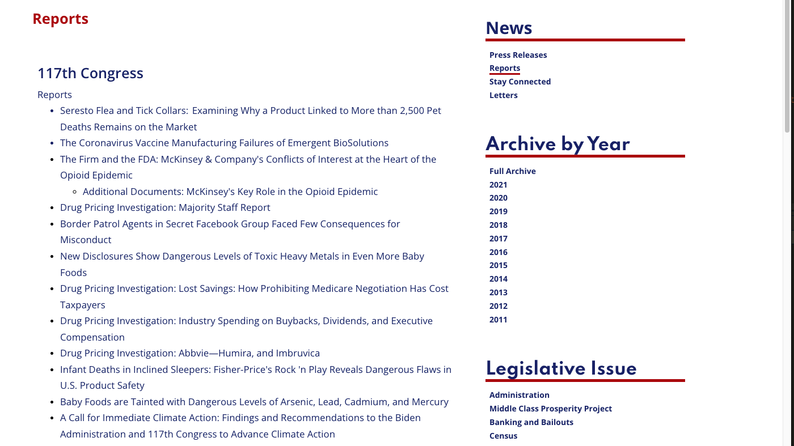

```{r preamble, child = here::here('preamble.Rmd')}
```


---
class: center, middle, inverse

# Representation


---


---
## Where We Have Been 


```{r}
plans = tibble::tribble(~`Issue`, ~`The New Jersey Plan`, ~`The Virginia Plan`, ~`The Conneticut Compromise`,
                "Supported By", "Small States", "Large States", "The Great Compromise",
                "Legislative Structure", "Unicameral", "Bicameral", "Bicameral",
                "Represention Plan", "Equal Representation for each State", "Representation based on population", "The Senate is 'equal' and the House is population based ")


gt::gt(plans) %>% 
  gtExtras::gt_theme_guardian()

```
???
If you think back to something like lecture 4 we talked about our founding documents. One of the big fights was over what representation looked like. 


As has been discussed earlier in the semester, many plans for representation were proposed at the Constitutional Convention by the Framers. In the end two were decided upon in an effort to address two different types of constituencies:

The Virginia Plan – provided for a bicameral legislature in which representation in which representation in both chambers would be based on population, advantaging larger states

The New Jersey Plan – provided for a unicameral legislature in which representation would be equal for every state.


As we know, the founders ultimately settled on the Connecticut Plan, or the Great Compromise. Under this plan, the Legislative branch was to have two chambers, one in which representation would be based on population and called the House of Representatives, and the Senate, in which representation would be equal for each state.

Additionally, Section 8 enumerates the powers of Congress and contains the “Necessary and Proper” (or Elastic) Clause. This clause grants Congress all powers that are necessary and proper for enaction of their enumerated powers. These “necessary and proper” powers are the Implied powers of Congress.


---

---
## House of Reps vs. Senate 

```{r}
bicameral = tibble::tribble(~"Basics", ~"House", ~"Senate",
                            "Minimum Age", "25", "30",
                           "Mininimum Years of Citizenship", "7", "9",
                           "Term Length", "2", "6",
                            "Representation", "Local", "State",
                            "Type of Election", "Direct", "Direct")

gt::gt(bicameral) %>% 
  gtExtras::gt_theme_guardian()

```
???

Go through chart for basic differences between house and senate. (age, required citizenship, representation and term lengths) 

Senatorial Representation – is based on a statewide level thus representing heterogeneity of state populations. The Framers intention was to create a body of statesmen that based their decisions on wisdom and deliberation with their interests attuned to the interests of those with property rather then the broader population population. 

This was sort of exemplified by the fact that before the 17th amendment senators were chosen by state legislatures

House Representation – the house was created for the direct link that it provided to the people with interests attuned to public opinion.  Thus the shorter term lengths to reflect societal change that occurs with shifts in population. 


Powers of the House exclusively – origination of all tax bills; vote to impeach 

Powers of the Senate exclusively – The senate confirms Presidential nominations; Holds the trial to impeach, and ratify all treaties. 

Advice and Consent – this is a special “power” of the Senate in which they are consulted/approached by the executive branch to approve treaties and appointments made by the President to various government positions (cabinets seats, federal judges, ambassadors, and US attorneys) 


---

---
## Differences Between the the First Congress and the 117th Congress

- Position and Workload

- Size 

- Political Parties  

- Size of the Staff 

- Amount of Legislation 

- Length of Bill 


???
Position and Workload – The position of Senator/Congressman was not the elite role that it is considered today. For the most part being a member of Congress in 1789 was not a full time job. The representatives for the most part were full time farmers, merchants, and artisans at home. Senators and Congressman assembled for roughly 2 sessions a year for between 10 and 14 days. Congress now on the other hand is a full time job with 40+ hour work weeks. Meeting 48 of 52 weeks of each year. 

Size – First Congress – 91 members: 65 representatives and 26 senators: Current Congress – 539 members 435 HOR 100 Senators 6 non-voting members 

Political Parties – There were no clearly defined political parties in the first Congress. Members were grouped as voting factions based on their record, not on pre-defined party characteristics.  

Size of Staff – the original congress had no additional staff with which to serve their constituency. Current members have an average 15 member staff in DC office as well as 100  member staff in home office. The size of staff fluxes greatly during campaign season with full time staff, part time staff, and volunteers numbering in the thousands depending on the size of the state/district. 

Amount of Legislation – The average session in Congress in 1789 last 14 days and produced roughly 25 bills per session . Current Congresses average between 10,000 and 15,000 bills, resolutions, and votes each year.  Roughly 1-3% of all the legislation that is proposed is actually enacted during each session.  The 113th Congress is the least productive Congress since 1947 passing only  251 pieces of legislation. 

Length of Bill – The average Bill length in 1789 was 2 pages. This average length of a bill now is 20 pages. The ACA was 2400 pages. The Longest bill in history prior to its passage was the 2007 budget bill passed by Bush. It was 1437 pages. 

Upon ACA’s passage a Senate staffer decided to bring home a completed copy in his suitcase. He had to remove it to avoid paying excess baggage charge

---


---
## Where Do We Get 435?

- First House had 65 members: 13 states
  - 1790 Census: expanded to 105 members
  - 1800 Census: expanded to 142 members: 16 states
  - 1920 Census: expanded to 435 members: 48 states

- Permanent Apportionment Act of 1929
  - Set the 435 Representatives cap
  - Why would Congress cap its own power?
  - WWI, Industrialization, mechanization of agriculture
  - Southern/Rural states who dominated the Senate pass the cap to maintain power

???
Despite adding two more states following the 1920 Census and the massive explosion in population our country faced in the following decades, the size of the House of Representatives has not changed since that 1920 Census. This is due to the Permanent Apportionment Act of 1929. This bill capped the size of the House of Representatives at 435 members, regardless of how much the population may have grown or shrank.

Why would Congress cap its own power and size?
This was largely due to significant changes that were taking place across the country. World War I, Industrialization, and the mechanization of agriculture saw drastic changes in the economic landscape across the country. As fewer people were needed in agricultural industries and more were needed in manufacturing, large elements of the population were leaving Southern and rural states to move industrialized states and cities.
At the time, the Senate was largely controlled by members from these Southern and rural states. These members passed the Permanent Apportionment Act in an effort to maintain power for their states.

This act has a large impact on how “well” the people are represented in Congress. It is worth looking at an example to see this.


---

---
## What Would it look like today 

```{r}
knitr::include_url("https://projects.fivethirtyeight.com/435-representatives/")
```


---

---
## Redistricting 

.pull-left[

```{r}
knitr::include_url("https://projects.fivethirtyeight.com/redistricting-maps/georgia/")
```

]

.pull-right[
- .bold[Redistricting]: the process of redrawing the geographic boundaries of legislative districts.
  - This occurs every 10 years with the Census to ensure that populations remain balanced within each district to ensure equal representation. 

.bold[Apportionment]: the process of adding and subtracting districts to add or subtract number of representatives in the House. 

- .bold[Gerrymandering]: the process in which district lines are redrawn to benefit specific political parties, protect incumbents, or to change minority proportions for representation


]

???
In addition to providing for reapportionment, the Census creates an opportunity for redistricting. This is the process of redrawing the geographic boundaries of legislative districts. If a state has gained or lost districts in the House, the remaining districts have to be drawn to either create these new districts or to absorb the territory/people in the previously existing district. 

However, some states may have to redistrict even if they have not gained or lost seats. At times, people may move drastically within a state, requiring a district to be shifted from one part of the state to another. An example would include a large shift of people from Atlanta to Athens. If this were to take place, Georgia may move one district from the Atlanta area and add it to the Athens area.

The process of redistricting is done by the state, and is usually controlled by the State legislature. This creates the problem of gerrymandering, which we have discussed previously
---

---
class: middle,center


```{r}
vembedr::embed_url("https://www.youtube.com/watch?v=A-4dIImaodQ")
```


---

---
##  How Do We Know This is a Problem?

- Efficiency gap – a measure created by political scientists to show which political party is benefiting most from a gerrymandered district
  - $\text{Efficiency Gap} =\frac{\text{Wasted Vote Party A} - \text{Wasted Vote Party B}}{\text{Total Votes}}$
  - A gap of 7% or higher is the proposed point that unconstitutional gerrymandering may have occurred 

- Partisan Dislocation: a measure of the difference between the partisan composition
of a voter’s geographic nearest neighbors and the partisan composition of the district to which
they have been assigned (DeFord et al. Forthcoming)

  - Basic Intuition: $\text{Partisan Dislocation} = \text{Vote Share}_{p,v} - \text{Voteshare}_{k,v}$

???
There is actually a heated debate over how to best measure this. The simplest way to do this is through what is known as the efficiency gap 

it uses the concept of a wasted vote. A vote is wasted if it is cast for a losing candidate or for a winning candidate but in excess of what she needed to prevail. So if you the democratic party wins by a margin of 70% than every vote past the plurality constitutites a wasted vote. In this case all 30% of the votes for the republican candidate are waisted 

This is clever in its simplicity but all together ignores lots of information that we have. One set of information would be like actual voter location n

where dem_vote_sharek,v is the share of voter v’s k nearest neighbors who are Democrats, and
dem_vote_shared, v is the Democratic vote share of v’s actual district d. Large positive values
indicate individuals whose district is substantially more Democratic than their nearest neighbors,
while large negative values are indicative of individuals in districts that are substantially more
Republican than their nearest neighb

Partisan vote share is the newest one where it looks at the difference between vote shares for a district where somebody votes and the nearest neighbor. Determining the nearest neighbor is done through a technique called k-nearest neighbors.  The KNN algorithm assumes that similar things exist in close proximity. In other words, similar things are near to each other. You can think of this as minimizing the distance between points on a graph. You interact with more complex implementations of this with recommendation systems or fraud detection software


---


---
## Is it Gerrymandering all The Way Down?


- Ehh no

--

- .bold[Partisan Sorting]: An effect in which similar voters migrate to specific areas, becoming more concentrated than in the wider electorate


???
Much like KNN birds of a feather flock together

One important aspect that is frequently neglected in the gerrymandering debate is the role that citizens play in this process. Bill Bishop argues in The Big Short that people are increasingly choosing their neighborhoods based on criteria that correlate highly with political preferences. This argument suggests that political segregation is a product of the movement of voters between neighborhoods—as kids grow up and move out of their parent’s homes, their subsequent choice of housing increases the political homogeneity of the American neighborhood.

This theory contends that as much of a problem as gerrymandering may pose, removing gerrymandering from the political process may not necessarily result in more competitive districts, because our neighborhoods are likely to politically homogenous, regardless.

Democrats more generally are a party that tends to be cluster in urban areas as well which poses a math problem in of itself. If in hypothetical state A most democratic areas are clsutered in three or four major cities but the rest of the state votes republican than 

---


---

class: center

<a href="https://www.statista.com/chart/18905/us-congress-by-race-ethnicity/" title="Infographic: How Diverse is U.S. Congress? | Statista"></a> You will find more infographics at <a href="https://www.statista.com/chartoftheday/">Statista</a>


??? 

As you can see the racial diversity of congress is some what on the lacking side 
---


---
## Gender


```{r}
gender_raw = read_csv("data/gender.csv")  %>% 
  select(-`Total Number of Members*`)


gender = gender_raw %>% 
  pivot_longer(names_to = "sex",
               cols = Men:Women,
               values_to = "count")  %>% 
  slice(1:10)

gt::gt(gender) %>% 
  gtExtras::gt_theme_guardian()
 

```


???
Congress is overwhelmingly pale and overwhelmingly male. Which really stands in stark contrast to America. One other thing to put a finer point on it 

 the professional background of many members of Congress is far different than that of the United States population. In particular, teachers and lawyers are vastly overrepresented in Congress, compared to the United States population. This is particularly true of lawyers. For example, while only 0.4% of the U.S. population possesses a law degree, roughly 35% percent of members of the House of Representatives have a law degree.


Over all, Congress does not do a great job of reflecting the diversity of the American population. This lack of representation is due to a number of different factors. 

First, gerrymandering plays a significant role in this lack of diversity. Because states draw lines to favor their political parties and sitting incumbents, this results in significant racial and gender advantages. Because white men tended to hold these seats before gerrymandering became more prolific, they tend to have a significant advantage in maintaining those seats once gerrymandering started to occur with greater frequency.

Second, the institution of voter ID laws in recent years has had a dramatic impact on voter turnout. This is particularly true for individuals that face more financial disadvantages which may prevent them from turning out, or those voters from racial and ethnic minority groups that are disproportionately affected by these laws. Each of these groups are more likely to vote for candidates that would increase the diversity of Congress, so when they don’t participate Congress is less likely to diversify.

Third, as we discussed in the last unit, voter turnout has steadily decreased in recent decades. Declines in turnout descrease the likelihood of new candidates being elected to serve in Congress, prolonging the lack of diversity.

Finally, changes to campaign finance rules in recent years have made it easier than ever for specific individuals to contribute to the campaigns of Congressional candidates. Again, as we have discussed, because people do not like betting on candidates that may not win an election, donors are more likely to contribute to candidates that have won an election. After all, the people that have already demonstrated an ability to win an election are also those that are most likely to win future elections.


---


---
## Two Models of Representation

.bold[Descriptive Representation] – member of Congress that shares the characteristics of constituents

.bold[Substantive Representation] – member of Congress that represents constituents interests on policy concerns

.bold[Delegate ] a member of congress that loyally represents constituents direct interests. 


.bold[Trustee] a member of congress that represents constituents interests while also taking into the bigger picture of national political concerns.


???
The relative lack of diversity in Congress is important because it has a profound impact on how elected officials represent their constituencies. One of the more obvious ways that representatives can represent their constituencies is descriptively.
Descriptive representation – (key term) – a member of Congress that shares the characteristics of constituents (race, gender, religion, etc.) 

This theory of representation contends that a representative that shares some kind of descriptive characteristic with the majority of their constituency is going to do a better job of representing that community. The idea is that representatives that have shared a similar life experience to their constituency is going to have a better idea of the kinds of problems that their constituents might face and the kinds of policies or changes would best help those communities.

Another theory of representation focuses on the substantive representation a member of Congress can offer their communities.

Substantive (key term) – a member of congress that represents constituents interests on policy concerns. 

This theory contends that it matters less how much a representative looks like their constituency. Rather, it is more important these members pursue policies that will have a positive impact on their constituencies or reflect the will and desires of their constituency

Each of these types of representation has an important impact on how members of Congress behave. Generally, there are two ways that representative can think about the votes that they take while in Congress.

First, a representative may choose to act as a delegate. These members strive to loyally represent the will of their constituents, regardless of how those preferences may impact the rest of the country or whether they personally agree with those preferences or not.

Delegate – (key term) – a member of congress that loyally represents constituents direct interests. 


Second, a representative may choose to act more as a trustee. These members see their role as to represent their constituents, while also balancing those interests with what is good for the WHOLE nation. These representatives may sometimes act in contrast with what their constituents would prefer because of national or moral concerns.

Trustee – (key term) – a member of congress that represents constituents interests while also taking into the bigger picture of national political concerns.


---


---
## What Does it Mean to be "Represented"

Three models on the National level:

.bold[Burkean Model (Edmund Burke)] – Legislators work for what they know is best for their districts and the nation
  - Trustee

.bold[Instructed Delegate Model] – Legislators will follow the will, or the voice, of the people in their districts exactly
  - Delegate

.bold[Responsible Party Model] – National party leadership with compromise between the two parties for the best outcome for the people 


???

These representation styles generally conform to one of three theoretical models of representation used by political scientists

First, the Burkean Model, named for Edmund Burke, states that legislators work for what they know is best for their districts and the nation. This may sometimes align with the will of their constituents, but may at other times be in conflict with those interests. This model is most inline with the Trustee representation type from the previous slide.


Trustee – (key term) – a member of congress that represents constituents interests while also taking into the bigger picture of national political concerns.


Second, the Instructed Delegate Model, contends that representatives will follow the will of their constituents at all times, exactly as they prefer, without concern for what the representative believes is best or what is in the best interest of the nation as a whole.

Delegate – (key term) – a member of congress that loyally represents constituents direct interests. 

However, I’m sure we can all think of problems with both of these models of representation. While we certainly want representatives that will represent our preferences and advocate for policies that we would personally prefer in Congress, doing so without regard for what the nation as a whole wants or needs is not ideal. After all, we all have to live with federal policies even if our representatives didn’t vote for them. Because of these concerns, there is a third model of representation that an elected official may strive to uphold.

The Responsible Party Model, contends that national party leadership should seek to compromise on their ideals in order to provide the best policy solutions for the nation. The idea here is that leadership can debate and work to craft policy that provides some advantages to each ideological position, while balancing the needs and preferences of everyone. Once this policy is crafted, these leaders can communicate the “wins” that their party has secured, guaranteeing support among their party members, and providing the best solutions to the nation.


This is where we are going to end today. On Thursday, we will spend a little more time taking about what the American people think of Congress and the electoral impact of those attitudes. We will then spend a significant amount of time talking about the powers of Congress, how the legislative process functions, and the role party leadership in this process.

---


---
## Do People Like Congress?

```{r}
knitr::include_graphics("approval.png")
```


???
Congress is almost comically hated in fact Public policy polling was curious about how it compared to other things
---

---
## "What do you have a higher opinion of?"

.pull-left[
### Things Congress Lost to

- Lice 67% vs. Congress 19%
- Colonoscopies 58% vs. Congress 31%
- Root Canals 56% vs. Congress 32%
- Used Car Salesmen 57% vs. Congress 32%
- Traffic Jams 56% vs. Congress 34%
- Carnies 39% vs. Congress 31%
- Nickelback 39% vs. Congress 32%
- Genghis Khan 41% vs. Congress 37%
- Cockroaches 45% vs. Congress 43%


]

.pull-right[
### Things Congress Won Against

- Lindsey Lohan 41% vs. Congress 45%
- Playground Bullies 38% vs. Congress 43%
- Telemarketers 35% vs. Congress 45%
- The Kardashians 36% vs. Congress 49%
- Gonorrhea 28% vs. Congress 53%
- Ebola 25% vs. Congress 53%
- North Korea 26% vs. Congress 61%
- Meth Labs 21% vs. Congress 60%


]

.footnote[Poll Conducted in 2013]


---


---
## Does this translate to re-election?

.pull-left[
### House of Reps
```{r}
house = read_csv("data/house_re-elect.csv")

ggplot(house, aes(x = Election_Cycle, y =   relection_rate )) +
  geom_col() + coord_flip() +
  labs(x = "Year", y = "Percent Re-Elected") + theme_allen_bw()


```


]

.pull-right[
### Senate
```{r}
senate = read_csv("data/senate_relect.csv")

ggplot(senate, aes(x = election_cycle, y =  re_election)) +
  geom_col() +
  coord_flip() +
  labs(x = "Year", y = "Percent Re-Elected") + theme_allen_minimal()

```

]
???
Despite almost universal hatred by the the general public congress has a pretty extraordinary level of retention

---

---
## Incumbency Advantage 

- Incumbency Effect
  - “Throw the rascals out! …but not my representative”

- Definition: the tendency of those already holding office to win reelection
  - Stronger for members of the House than members of the Senate

???
The tendency for incumbents to win reelection despite Congress having relatively low approval ratings is largely due to the Incumbency Effect. This is the tendency of those already holding office to win reelection. This is largely because most voters see their representatives as the one good member in the entire Congress. Essentially, the problem with Congress lies with everyone else.

---


---
## Dimensions of the Advantage 

- Incumbency Advantage
  - Name Recognition    
  - More Visible
  - Media Exposure
  - Credit Claiming
  - Experience
  - Voting Record
  - Casework
  - Fundraising Ability


???
Additionally, being a sitting member of Congress provides a number of advantages that can be used in elections to ensure that an incumbent wins their race. These advantages include:

Name Recognition – By being a member of Congress, people are just more likely to be familiar with who you are. They may not always know why they know a members name, but they do know it.

More Visibility – Member of Congress are able to be more visible to voters, in large part because they can leverage their position to get more media exposure. News shows are always looking for members of Congress to come on and explain what Congress is working on, or potential solutions to whatever problems are currently being discussed through out society.

Credit Claiming – This media exposure also allows member to claim credit for the work they are doing. If a member has written a bill or is spearheading a new initiative, they are able to discuss those activities and demonstrate that they are working to improve the lives of their constituents.

This credit claiming is an example of how members leverage their experience serving on specific committees (which we will discuss later today) and their voting records. Each of these allow voters to understand the tangible benefits that their representatives provide them. These two things allow voters to rely on retrospective voting (which we discussed in detail in the last unit), which is easier for most voters to do, and provides less uncertainty about what the member will do in future terms in Congress.

Additionally, a significant amount of work that members of Congress actually do is known as Casework. There are a number of ways in which individuals rely on the federal government to directly provide benefits to them through programs like Social Security, Medicare and Medicaid, VA benefits, and SNAP benefits. However, there are sometimes problems with how these programs are rolled out, which can create significant delays in individuals receiving their benefits. When this happens, frequently, the easiest thing to do is to reach out to your elected member of Congress to get them to pressure those institutions in releasing benefits. This work is known as Casework and provides a significant advantage to a member of Congress.
This activity allows member of Congress to very directly provide tangible benefits to their constituents. Additionally, constituents who receive assistance through Casework are far more likely to tell their friends and family about the help that they received. This positive word of mouth can provide a much better electoral advantage than many other forms of campaigning.

Finally, by being a member of Congress, incumbents have a much greater ability to raise funds for their reelection campaigns than their challengers can. First, members of Congress have access to the biggest donors within their political party and can personally reach out to them in ways that challengers can’t. Secondly, these donors are extremely unlikely to contribute to politicians that may not win. Again, the best way to demonstrate that you can win an election, is to win an election. Thus, by being a member of Congress, incumbents already have a proven track record of winning elections, and are therefore much more likely to receive those donations.


---


---
class: center, middle, inverse

# Congress


---


---
## Enumerated Powers of Congress


- Lay and collect taxes 
- To borrow on the credit of the US
- To regulate Commerce 
- To establish uniform rule of Naturalization
- To Coin Money 
- To Provide for Punishment of Counterfeiting Money 
- To Establish Post Offices 
- To Promote the Progress of Science and useful Arts– Copyrights 
- To constitute Tribunals inferior to the  Court 
- To define and punish Piracy and Crimes on the High Seas 
- To Declare War
-  To raise and support Armies 
- To provide and maintain a Navy 
- To make rules for governing and regulating the military 
- To provide for militias to suppress insurrection or repel invasion
- To organize, arm, and discipline the Militia in service to the US
- To make laws  


---

---
## Special Powers of Each Chamber


- House
  - Vote to impeach
  - Origination of all Revenue bills
- Senate
  - Nominations & confirmations 
  - Holds the trial to impeach
  - Ratify all treaties


---


---
## The Ones We Will Focus On

- Impeachment

- War Powers

- Oversight

- Lawmaking

???
We will not be exploring all of the enumerated powers of Congress. Rather, we will be focusing on the five listed here.


Oversight – (key term) – efforts by congress to make sure that laws are implemented correctly by the bureaucracy after they have been passed. 


War powers – Congress has to officially declare war. Does this happen every time? Are there examples of when this did not happen? 
	Fun fact: Last official declared war by Congress was WWII.   

 

---

---
## Impeachement 

- The check that Congress has over the other branches that - allows them to remove officers of the United States for - various different abuses of powers
 
- Does _*NOT*_ mean removal from office
  - 4 Presidents
  - 15 Federal Court Judges
  - 1 Senator


???
Impeachment is the check that Congress has over the other branches that allows them to bring charges against and remove officers of the United States for various different abuses of powers.  

THIS DOES NOT MEAN REMOVAL FROM OFFICE. Impeachment is merely the first step of bringing charges against an individual. Removal from office is a separate procedure.

Impeachment proceedings begin in the House of Representatives. If an impeachment vote is passed in the House, the chargers are forwarded to the Senate. In the Senate, once the charges have been forwarded, a trial takes place on the floor of the Senate, which is presided over by the Chief Justice of the Supreme Court. At the end of the trial, a vote to remove the official is brought and must be passed with a 2/3 majority for the official to be removed from office.

Impeachment proceedings have occurred for three presidents (Clinton, Johnson, and Nixon), senators (1) and Federal Judges (15).  

Some of the offenses for which impeachment charges have been brought include: abuse of power, drunkenness, rebelling against the government, and perjury.  


----


---
## War Powers

- .vero-red[War Powers Clause]: [The Congress shall have Power…] To declare War, grant Letters of Marque and Reprisal, and make Rules - concerning Captures on Land and Water

- .vero-blue[War Powers Act of 1941]
  - American emergency law that increased Federal power during World War II

- .vero-brown[War Powers Resolution of 1973]
  - Federal law intended to check the president’s power to commit - the United States to an armed conflict without the consent of - Congress
  
- .hiro-dark-blue[Authorization for Use of Military Force 2001]

  - The authorization granted the President the authority to use all "necessary and appropriate force" against those whom he determined "planned, authorized, committed or aided" the September 11 attacks, or who harbored said persons or groups


???
The second enumerated power of Congress is the War Powers.
Congress has the exclusive power to officially declare war. However, in the modern era, this power has rarely been used. The last time war was officially declared by Congress was during World War II.
Despite it’s rare usage, Congress has passed a number of bills related to it’s war making powers.
The first was the War Powers Act of 1941. This act dramatically increased federal power during World War II, authorizing Franklin Roosevelt to reorganize the Executive branch and the Bureaucracy to streamline the war effort. A subsequent act passed in 1942 which allowed the federal government to acquire any land within the United States for the war effort, among other things.

Following the Executive branches continued willingness to engage in military conflicts without a declaration of war, Congress passed the War Powers Resolution of 1973. This act requires the president to notify Congress within 48 hours of committing armed forces to military action, and requires the president to seek continued approval for troop deployments within the first 60 days.


---


---
## What About...


```{r}

df = tibble::tribble(~Conflict, ~`Legal Basis`,
                     "Korea (1950-1955)", "Police Action",
                      "Vietnam (1961 - 1975)", " Joint Resolution of Congress ",
                     "Lebanon (1982-1983)", "Lebanon Emergency Assistance Act/UN multinational force",
                     "Gulf War (1990 - 1991)", "UN Security Council Resolution", 
                     "Afghanistan (2001 - 2021)", "Authorization for the Use of Military Force 2001",
                     "Iraq (2003 - 2011)", "AUMF")

gt::gt(df) %>% 
  gtExtras::gt_theme_guardian()

```


---

---
## Oversight 

- Oversight – over Bureaucracy
  - Efforts by Congress to make sure that laws are implemented correctly by the bureaucracy after they have been passed
  

```{r out.width="60%"}

```

.footnote[[Source](https://oversight.house.gov/news/reports)]
???
Congress’s oversight abilities apply to the Bureaucracy, and refers to their efforts to make sure that laws are implemented correctly after they have been passed. This is usually done through a series of hearings in which members of the bureaucracy are called to Congress to discuss the procedures that they have implemented to enact laws.

These investigations can be pretty sprawling and lead to pretty significant findings or are tucked away in reports. You can go to the page and read the reports. There are a ton of them. The revealations about COINTELPRO were from a series of Senate select oversight committee hearings most commmonly refered to as the church committee 

 a series of covert and illegal projects actively conducted by the United States Federal Bureau of Investigation (FBI) aimed at surveilling, infiltrating, discrediting, and disrupting domestic American political organizations. FBI records show COINTELPRO resources targets groups and individuals the FBI deems subversive, including feminist organizations, the Communist Party USA, anti–Vietnam War organizers, activists of the civil rights movement and Black Power movement (e.g. Martin Luther King Jr., the Nation of Islam, and the Black Panther Party), environmentalist and animal rights organizations, the American Indian Movement (AIM), independence movements (including Puerto Rican independence groups such as the Young Lords and the Puerto Rican Socialist Party), a variety of organizations that were part of the broader New Left, and far-right groups such as the Ku Klux Klan and the National States' Rights Party


---


---
## How a Bill Becomes a law


.pull-left[
### Path of Least Resistance
```{r}
vembedr::embed_url("https://www.youtube.com/watch?v=OgVKvqTItto")
```
]


.pull-right[
### How the Sausage Gets Made

```{r}
vembedr::embed_url("https://www.youtube.com/watch?v=s5eILKG5oSE")
```

]
???
Now, the Schoolhouse Rock example is really the best case scenario. Now watch the video hyperlinked in this slide. It provides a much more realistic example of the lawmaking practice works in person, and the role that parties and party leadership can play in the process.

---
## How the Sausage Gets Made


.pull-left[
### House 

- Speaker of the House decides where to send a bill
  - Committee
  - Subcommittee
  - Subcommittee Committee Hearing
- Report to full Chamber of House
- Referred to Rules Committee
  - Here they place a “rule” on the bill
  - OPEN Rule – No limits on Amendments
  - CLOSED Rule – No Amendments at all
- Goes to the House floor for votes
- If approved, the bill goes to the Senate


]

.pull-right[
### Senate
- President of the Senate sends to committee
  - Committee
  - Subcommittee
  - Subcommittee Committee Hearing
  - Report to full Chamber of Senate
- .bold[NO RULES COMMITTEE IN SENATE]
- Goes to Senate floor for votes
  - Here Senators may filibuster bills 
  - Filibusters are ended with a cloture vote
- If Senate version is different from the original House - version the bill is sent to a Conference Committee: 
  - Conference Committee - members _from both chambers review the new bill_ 
- If the Conference Committee’s proposal is approved in both Chambers the bill is sent to the President of the United States


]

???
Now that we’ve watched these two separate examples of two very different ways that laws can be made, let’s look at this process in detail. We are going to assume that bills begin in the House for this step-by-step explanation, but you should note that, with the exception of tax legislation and budgets, bills can begin in either the House or the Senate. The overall process is the same regardless of where a bill begins, though.

So once a bill has been written and proposed, it is presented to the Speakers of the House.

The Speaker of the House then decides which committees to send the bill too. The Speaker can assign the bill to as many committees and subcommittees as they wish. If the Speaker does not want the bill to come to a vote, they will frequently use this process to “kill” the bill by assigning it to as many committees as they can.
Once the bill is assigned a committee, the committee will hold a series of hearings where they ask for testimony from those that may be affected by the legislation and any relevant bureaucratic agencies that will be impacted by the bill. Additionally, each of these committees can propose changes and amendments to the bill. These are all voted on by the committee members and are either added to the bill or rejected at this stage. Once a committee is done with their hearings and proposed changes, they will take one final vote on whether they should report favorably on a bill or not. This is a simple majority vote.

If a bill is reported on favorably in all of the committees it is assigned to, then it (and all of the amendments that the committees may have added) are reported to the full Chamber of the House. However, before the full House can begin debating the bill, the piece of legislation is sent to the Rules Committee

The Rules Committee is unique to the House and determines whether amendments from the full House will be allowed to be debated and added. If the Rules Committee assigns an Open rule, then there are no limits placed on the ability of any member of the House to propose an amendment. However, if the Committee assigns a Closed rule, then no amendments to the bill can be proposed, debated, or added to the piece of legislation.

Assuming that an Open rule has been placed on the legislation, once the bill is reported out of the Rules Committee it goes to the floor of the House where it is debated, and amendments are proposed, debated, and voted on. Remember that the Speaker of the House controls how long legislation is debated in the House, so this can either be a very long or very slow process.

However, once debate on the legislation is ended, the full House votes. If it is approved with a simple majority vote, then the legislation is passed on to the senate. If it is not approved by a majority of the House, then the bill dies, and must be re-proposed in future terms.

If the bill is advanced to the Senate, it’s first stop is to the President of the Senate. The President of the Senate then assigns the committees and subcommittees that the bill will be assigned to. There the same process of hearings, amendments, and changes as in the House takes place. Again, at the end of this process, each committee votes on whether to advance the legislation to the full Senate.

If the legislation is reported favorably out of each of the Senate committees it has been assigned to, it is reported to the full Chamber of the Senate. One major difference between the House and Senate processes is that the Senate does NOT have a Rules Committee. Rather, all pieces of legislation can have amendments from the full Senate proposed and voted on. Additionally, unlike the House, there is no limit on how long the Senate can debate a bill. This is due to the filibuster process that exists in the Senate; we will talk about this more in just a minute, but for now you can think of filibustering as just talking a bill to death. The only way to end debate is with a Cloture vote. Once debate has ended, a full vote on the bill takes place.

Assuming that the bill also passes the Senate, it is not automatically sent to the President, even if it has already been approved by the House. At the end of this process, it is extremely likely that the pieces of legislation that have been passed by the House and the Senate are different from each other. In this case, both versions of the bill are sent to a Conference Committee, which is made up of members from both the House and the Senate. The job of the Conference Committee is not to make the two versions of the bill identical. Once these changes are made, the new version of the bill is sent back to the House AND the Senate to be voted on again.

If this piece of legislation is then passed by both chambers of Congress again, the bill is FINALLY sent to the president’s desk.


---


---
## How the Sausage Gets Made continued

Once a bill reaches the President he has 10 days to act:

- Sign the Bill and it becomes law
-  Veto
  - 2/3 Support from both chambers may override a veto

- Not Sign
  - Automatically becomes law after 10 days while Congress is in  session
  - Pocket Veto – If Congress adjourns during the 10 day period and the president does NOT sign, then the bill is vetoed and does not become law


---

---
## Committees

 Committee Types:
 
 
 
- Standing: Committees that exist from session to session and have the power to propose and write legislation over a - particular subject matter
Subcommittees

- Select: Non-permanent committees that are established that highlight particular issues that arise within legislation

- Joint: Committees that are formed with joint membership from - the House and the Senate
  - Four are permanent

- Conference: Temporary committees appointed by Speaker and the presiding Senate leadership intended to form a consensus of legislation between the two chambers

???
The last part of Congress’s structure that we need to spend a bit more time discussing. I’ve talked a lot about committees in the last few minutes, there are important difference between different types of committees.

First, committees are specialized units created in Congress to provide functionality and due process to the creation of legislation. These committees are often broken down even further into subcommittee units in order for more specialization on bill content, and take many different forms. 

Standing committees–are committees that exist from session to session and have the power to propose and write legislation over a particular subject matter. They generally correlate in subject matter to specific executive branch departments or agencies. 

Select committees– are non-permanent committees that are established the highlight particular issues that arise within legislation that may or may not be under the jurisdiction of other existing committees. 

Joint committees– are committees that are formed with joint membership from the House and the Senate. There are 4 that exist permanently. They are powerful in the investigative sense but do not have the power to present legislation.

Conference committees– temporary committees appointed by Speaker and the presiding Senate leadership. They are formed in an effort to form a consensus on legislation between the House and the Senate.  These committees are crucial during times when the House and Senate majority are of opposing parties. 

---


---
## Most Powerful Committees in Congress

.pull-left[
### House

- Appropriations 
  - Money - regulate expenditure of US govt 
- Budget 
  - Reviews Federal budget process 
- Rules 
  - Determines all the rules of how a bill can come to the floor 
  - “traffic cop of Congress” 
- Ways and Means 
  - Writes all tax legislation and revenue programs 
  - If a member it is only committee member can serve on 


]

.pull-right[

### Senate

- Appropriations 
  - Money - regulate expenditure of US govt
- Armed Services 
  - Legislative oversight of all US military branches 
- Finance 
  - Legislation concerning taxation and other revenue programs 
- Foreign Relations 
  - Oversees all foreign-policy legislation including foreign aid, funding, and treaty ratification 


]

---

---
## Special Votes

- Filibuster: Tactic used by senators to block a bill by - holding the floor and speaking to extend debate and prevent a  vote.

- Cloture: Procedure in which senators can limit the amount of  debate on a bill with a supermajority (60) votes.

- Override: In the case of a president vetoes a bill each House of Congress can vote for an override (2/3) to pass the bill.


???

Finally, there are a few special kinds of votes that we’ve discussed that you will need specific definitions for.

The first of these is the filibuster vote. Filibustering is a tactic used by senators to block a bill by holding the floor and speaking to extend debate and prevent a vote. Filibusters can only last for as long as a senator, or a group of senators, can hold the floor for and prevent the ending of the debate period.

Cloture is a procedure in which senators can limit the amount of debate on a bill with a supermajority vote.
Cloture was first introduced in 1917 and remained a senate rule until 1949. 
The rule was reinstated in 1959 and required a 2/3 majority. 
This was revised in 1975 so that 3/5 of sworn senators could limit debate, except for changes to Senate rules which still require a 2/3 vote.

Because of the extensive time that filibusters can take, the preference in recent years has been to move to other business when a filibuster has been threatened and cloture attempts have failed.


Finally, override votes are only done in the case of a bill being vetoed by the president. This vote requires a 2/3 majority in both the House and the Senate to be successful.

---