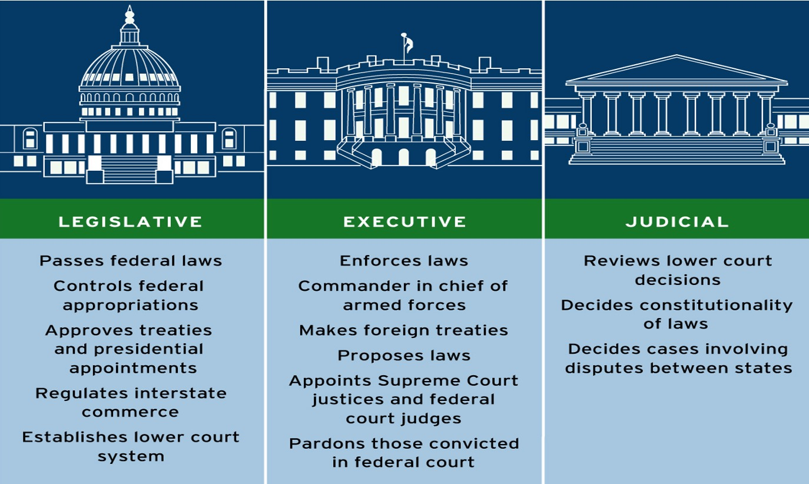

```{r preamble, child = here::here('preamble.Rmd')}
```


---
class: center, middle

## Looming Deadlines


---

---
# Important Concept For The Test
## And Basically the Rest of American Government 

- The Supreme Court has very narrow authority under a strict originalist interpretation of the constitution
  - Typically, the disputes between states coming to the Court involve conflicting property claim 
  - disputes between a state and a citizen of another state

--
However, the modern Supreme court 

- .bold[Judicial Review]: is the implied power of the Supreme Court to have the authority to declare laws of Congress and acts of the executive branch unconstitutional.

- Established in Marburry v. Madison(1803)

???

We have heard me at various times say: this was adjuduicated in court 


The presidential election of 1800 was a critical time in early American politics. The two main parties (review from Foundations) were the Federalist and Anti-Federalist (often called the Democratic-Republican) parties, and each was vying for an extra ounce of power. In a close election, Thomas Jefferson (D-R)  beat out John Adams (F) to become the 3rd president of the United States. The election took place in February, but Jefferson did not assume office until the middle of March. During this time the federalist party was doing everything possible to maintain any political power they could. 

In this case, John Adams went on a spree of appointments of judges since he was still the president and his party still controlled the Congress. In those few weeks he appointed over 60 individuals to federal court judgeships and justice of the peace positions, including one to William Marbury (pictured far left), a wealthy Virginia businessman.  These individuals came to be known as “midnight judges” since their appointments and confirmations occurred in the space of a day. The confirmations all occurred, but Adams ran out of time before all the commissions could be delivered.  

---

```{r}


court_data = read_csv("SCDB_2021_01_caseCentered_Citation.csv")


cert_decision_data = court_data |> 
  select(term, jurisdiction) |> 
  mutate(qual_jurisdiction = case_when(jurisdiction == 1 ~ "cert",
                                       jurisdiction == 2 ~ "appeal",
                                       jurisdiction == 3 ~ "bail",
                                       jurisdiction == 4 ~ "certificaation",
                                       jurisdiction == 5 ~ "docketing fee",
                                       jurisdiction == 6 ~ "rehearing or restored to calendar for reargument",
                                       jurisdiction == 7 ~ "injunction",
                                       jurisdiction == 8 ~ "mandamus",
                                       jurisdiction == 9 ~ "original",
                                       jurisdiction == 10 ~ "prohibition",
                                       jurisdiction == 12 ~ "stay",
                                       jurisdiction == 13 ~ "writ of error",
                                       jurisdiction == 14 ~ "writ of habeas corpus",
                                       jurisdiction == 15 ~ "unspecified, other"))


cert_sum = cert_decision_data |> 
  group_by(qual_jurisdiction) |> 
  summarise(total_jurisdiction = n()) |> 
  filter(qual_jurisdiction %in% c("original", "cert")) |> 
  mutate(qual_jurisdiction = str_to_title(qual_jurisdiction))

ggplot(cert_sum, aes(x = total_jurisdiction, y = fct_reorder(qual_jurisdiction, total_jurisdiction), fill = qual_jurisdiction)) +
  geom_col(alpha = 0.7) +
  labs(y = "Type of Jurisdiction", x = "Total", fill = NULL, title = "Kinds of Cases the Court Hears",
       subtitle = "1946-2021") +
  geom_text(aes(label = total_jurisdiction), nudge_x = 220) +
  guides(fill = 'none') +
  MetBrewer::scale_fill_met_d("Demuth") +
  theme_allen_minimal(has_subtitle = TRUE)


```
???
Parties who are not satisfied with the decision of a lower court must petition the U.S. Supreme Court to hear their case. The primary means to petition the court for review is to ask it to grant a writ of certiorari. 

This is a request that the Supreme Court order a lower court to send up the record of the case for review. The Court usually is not under any obligation to hear these cases, and it usually only does so if the case could have national significance, might harmonize conflicting decisions in the federal Circuit courts, and/or could have precedential value


.bold[Original] - the power of the court to hear a case for the first time without needing to go through a trial level case.


---
## What is Government 

A Set of institutions that 

-

-

-


???

- Endure overtime 


- Has **authority over the people** of a specific territory


- Authoritatively **makes and enforces laws**


---


---
## Matching Governments to Branches

What branch of government would we consider these?


```{r}
pacman::p_load("ggwordcloud")


branches_of_gov = tribble(~branch,
                          "Bureacratic Agencies",
                          "Supreme Court of the United States",
                          "The Governor of Georgia",
                          "The Georgia General Assembly",
                          "Supreme Court of Georgia",
                          "The President of the United States",
                          "The U.S. House of Representatives",
                          "The U.S. Senate",
                          "Federal Courts")


ggplot(branches_of_gov, aes(label = branch)) +
  geom_text_wordcloud() +
  theme_minimal()


```


---


---
## The Collective Action Problem 

.pull-left[
.bg-light-blue.b--blue.ba.bw2.br3.shadow-5.ph4.mt5[

Multiple individuals would benefit from a certain action,  but this action has a cost that makes it implausible that any individual can or will undertake and solve it alone 

.tr[- Mancur Olson]


]]


.pull-right[
### Public Goods 

- Non-rivalrious 

- Non-excludable

]


---


---
## What Other Kinds of Goods Are There??

- Lots!!
<center>


</center>

---

---
## Selective Incentives 

```{r examples}


selective_incentives = tribble(~Incentives,
                               "Tax Credits", "Fines",
                               "Tax Breaks", "Higher Taxes",
                               "Convincing", "Shaming",
                               "Production Based Incentives", "Jail Time")


ggplot(selective_incentives, aes(label = Incentives )) +
  geom_text_wordcloud() + 
  theme_minimal()


```


???
Okay using what we know about government so far how can we start to think of what the book calls the power of the purse and the power of the sword? Well start to think of the little graphic I keep posting 

---


---
## Rule of Law 

## Constitutional Democracy
.pull-left[
<center>
<gsu-blockquote-alt>


Governments, like the United States, that are effectively bound by ___  are called “constitutional governments.”


</gsu-blockquote-alt>
</center>
]

.pull-right[

- **Rule of Law**: 

- **Fundamental law**:  ] 

???
Fundamental law 

**Rule of Law**: The idea that **all** citizens, **including government officials**, are bound by laws

**Fundamental law**: The federal government is bound by the laws declared in the Constitution. If a statute is in conflict with the law of the constitution, then the statute is considered unlawful.
---


---
## Constitutional Government 

.pull-left[

<gsu-blockquote-blue> 
If men were angels, no government would be necessary. If angels were to govern men, neither external nor internal controls on government would be necessary. In framing a government which is to be administered by men over men, the great difficulty lies in this: you must first enable the government to control the governed; and in the next place oblige it to control itself. 

</gsu-blockquote-blue>

]

--


.pull-right[

The purpose of constitutional government is to empower and limit its power

Done Through auxiliary precautions 
 


]
???
is to empower and limit its power

Done Through auxiliry precautions  Dependence of the people Checks and Balances 


---

---
# Two Kinds of Democracy 

- Direct Democracy: 


- Representative Democracy 


???
Direct Democracy: “pure” democracy - one in which the people make the decisions in the manner in which political powers should be exercised.


Representative democracy – where the authority of the governments lies with the people (the electorate) that elect representatives to support their interests


---


---
class: center, middle, inverse

# The American Way of Politics


---

---
## Ideological Positions 

```{r echo= FALSE}
ideology_dt = tribble(~Issue, ~Liberals, ~Conservatives, 
                       "Regulating the Economy", "Supports Govt Regulations", "Supports Less Govt Regulation",
                       "Economic Security", "More Supportive Programs", "Supports Programs but at lower levels",
                       "Government Promotion of Social Equality", "Wants laws/programs to increase social standing of historically oppressed groups", "Generally favor the status quo",
                       "Traditional Moral Values(Abortion, prayer in schools, same-sex marriage etc", "Generally oppose", "Supports laws/programs that uphold these traditional values",
                       "Law Enforcement and Criminal Justice", "Want body cams on police/dashboard.  Oppose: death penalty, long prison sentence, mandatory minimum sentencing laws, restrictions of felons after serving their time.", 
                       "Greater leeway to police.  More likely to support “Law & Order” policies like the death penalty, long prison sentences, mandatory minimums, restricted rights for former felons.")

ideology_dt_long = ideology_dt |> 
   pivot_longer(cols = c("Liberals", "Conservatives"),
               names_to = "Ideology",
               values_to = "Stance") |> 
  slice(1:8)


ggplot(ideology_dt_long, aes(label = Stance)) +
  geom_text_wordcloud() +
  scale_size_area(max_size = 14) +
  theme_minimal()

```

???
Politics of Interest: Struggle to exert influence over government emanating from conflicting economic interests and the efforts by individuals and groups to advance public policies that benefit themselves and pass burdens onto others. (Contrast with Politics of Principle)


Politics of Principle: Political conflicts emanating from genuine disagreements over ideology, justice (e.g. what rights we have), and/or what will truly be advantageous for the people.


---

---
# Answers 

```{r}
gt(ideology_dt) |> gtExtras::gt_theme_espn()
```


---


---
class: center, middle, inverse 

# The Constitution

---


---
## Design Principles (AOC)

What were the weaknesses:

-


- 

-

-

- 


???

- Confederacy 

- Weak Central Authority

- No Clear Supremacy of Authority 

- Super Majority Required to do Anything

- **No** Direct Authority Over the People


The articles of confederation is interesting. The last bullet point limits the way in which the government has power over people. Instead, it only claims authority, and seeks to exercise power, over the state governments. In this sense, the central government in a confederacy is best described as a government over governments instead of a government over individuals

This is kind of bold because if you have done the chapter you know that states could only be requistioned. Which is just fancy for "be asked nicely to pay the federal government" 

The great vice of that the study guide refers to is the first bullet point. Effectively as we have covered the states held so much power that the centeral government could not excercise any of the limited power that it had. If this part of the study guide was confusing it was because it is like a snippet of an entire essay that you could only find if you clicked on an endnote.

---


---
## Design Principles of The Constitution

- 


- 


- 

-

-


???

- Federalism 

- Popular Sovereignty 

- Representative Democracy 

- Separation of Powers 

- Small List of Civil Liberties


Federalism: Splits the difference  between full unitary or full confederacy 
The early federalism kind of made clearer distinctions over what policy areas should be handled by the Federal gov and what responsibilities were the states. While also making sure there was a clear mechanism between resolving conflicts between state and federal law.


Popular Sovereignty: The book highlights how the constitution has many avenues to amending the constitution. It also highlights that the constitution is ratifyied under the authority of the sovereign people. 

Representative Democracy: the direct enshrinement of the right to elect politicians. While there is some odditites like how senators are elected and how we (still) elect the president. However, this was pretty unique at the time. While who was allowed to do this was severly constrained

Seperation of powers: This is still a pretty interesting idea. Among the institutions in the US each has some unique authorities, and has the ability to make the others life harder. The original idea was to create branches that were co-equal but were not really meant to be trusted. To ensure that the protections they wrote down were protected

seperation of powers just comes from a dead french guy named Montesquieu.

civil liberties: part of the opposition to the constitution was just how powerful the central government was. To ensure that they had enough support to actually past the thing they had to concede to some anti-federalist systems. Part of this was to specifically guarantee protections for individual rights 


---


---

---
## The Branches 

```{r branches, echo=FALSE, out.width= "80%"}



```


---

---
class: center, middle
## Checks and Balances


---


---
class: center, middle, inverse

# Federalism 


---

---
## Benefits and Weaknesses 

.pull-left[
### Greater National Authority


]

.pull-right[
### Greater State Authority


]
???
Greater national authority bit 

Preserves the union

Reduces compliance costs

Provides national public goods

Reduces negative externalities

Protects minority rights

Prevents races to the bottom


Greater State Authority 


Protects liberty

Represents local diversity

Allows for policy experimentation

Benefits from foot voting

Fosters democratic citizenship


Preserving the union: If we give to much power to the states they start acting like their own mini countries making the union weaker

reducing compliance costs: if we have one set of rules it makes things easier to monitor and there are clearer red lines. Rather than lots of different red lines

negative externalities: stronger national governments are in better positions to monitor and fix market failures. If we remember back to our collective action problem. An externality is: A cost or benefit to someone who did not choose that cost or benefit. In essence it is something that is outside the price but effects the price. The cost of something is lower than it should because the producer is not actually bearing that cost. We will inevitably end up with a lot stuff like pollution because producers bear none of the costs but in essence we all do. Stronger central governments are in better positions to ensure that somebody bears the cost 

Preventing races to the bottom: This is kind of intersting because as we went over there are a whole host of regulations. States use attractive tax packages to get companies to relocate. This brings a whole host of benefits. If you are trying to bring in big tech you get prestige, an influx of higher incomes, a natural demand for more stuff, and lots of capital

The federal government is in a much better position to bargain vis a vis larger corporations in some respects. States want to keep businesses and jobs within there states rather than in somebody elses state. So they are more willing to make favorable deals. The federal government is primarily concerned about keeping some industries within the US. The threat of exit for some industries are less credible than others. While some politicians rely on certain sectors to provide votes due to the make up of factors in their districts. 

---


---
## Races to the Bottom

```{r }

vembedr::embed_url("https://youtu.be/3XE5m_meLVw?t=81")

```


---


---

## That Federalism Video

```{r}
vembedr::embed_url("https://www.youtube.com/watch?v=J0gosGXSgsI&t=5s")

```

---


