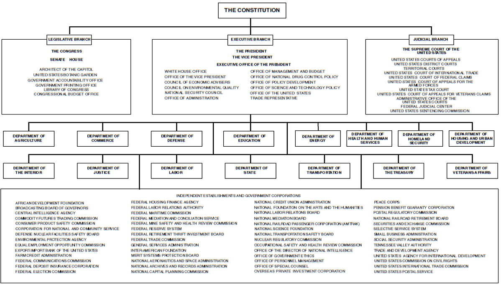
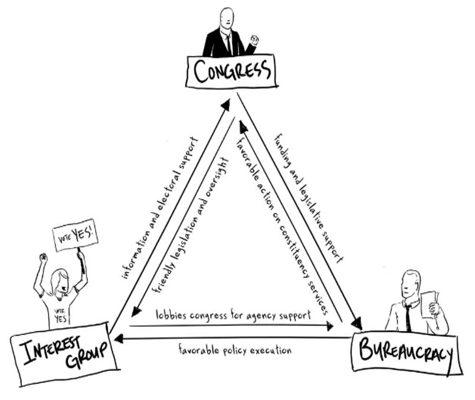

```{r preamble, child = here::here('preamble.Rmd')}
```


---

## Qualifications

- 35 years old

- Natural born citizen

- Retain residency in the US for at least 14 years

- 12th Amendment (1804) 

- 22nd Amendment (1951) fixes the number of terms to 2

???
These are the constitutional qualifications to be president as set aside in Article II, Section I, Clause V.  (the twelfth amendment also extends these qualifications to the vice-president (1804).) 

Natural born – must be a born in the United States – differentiation from individuals that attain citizenship 


The 12th amendment basically just extends the minimum qualifications for president to anybody in the line of succession


22nd amendment – the Constitutional amendment that limits the number of terms that a president can serve to two. 

---

---
## Constitutional Sources of Power


.pull-left[

### Expressed Powers 

- Derived from Article II USC
- Head of the Executive Branch (bureaucracy)
- Commander-in-chief
- Enter in treaties with foreign nations
- Make judicial/executive appointments


]


.pull-right[
### Implied Powers

- Derived from the “Take Care Clause” of Article II USC
- Organizing the Federal bureaucracy (create executive - departments: Homeland Security)
- Issue Executive Orders


]

???
Enumerated

Military: President is the highest military authority in the USA, with control of the entire military establishment. Also heads all intelligence agencies. 

This point can spark some discussion about how the president has used his power as commander in chief to expand his power, but it’s covered more later in the presentation. 


No President that has served has served in the Marines or in the Coast Guard. We have had 3 presidents  that have been Generals in the Army (Washington, Grant, and Eisenhower). We also have only had 12 presidents that have no military service.  15 presidents served in the Reserves and 9 served in State militia. 


Judicial
 Nixon. Historical link to how the President can be one where supplicants can seek mercy, like Kings used to do. 

Nixon – pardoned for crimes by Ford after his resignation from the presidency for abuses of power. Ford pardon came as an effort more for public opinion and resurgence in faith in the government rather then because he wasn’t guilty. 

Turkey pardons – By far the most famous of the all pardons is the one that occurs each year at Thanksgiving of the presidential turkey. This has been a tradition at the White House since H.W. Bush was in office (1989). Generally, the turkeys are sent to petting zoo’s across the nation.  It is a national contest each year that is run by the white house, last years turkeys were named Popcorn and Caramel. Unfortunately, Popcorn won the popular vote, but eventually both Turkeys were spared.  Unfortunately, the common trend of obesity in these turkeys eventually cause them to die within a year of being pardoned.) 

Diplomatic – rise of Executive Orders over Legislative law due to difficulty of securing the consent of the senate.  Executive orders have been on the rise since the political division between the President and Congress has grown more volatile. 
Executive – talk about appointments of Judges and heads of Agencies. 

Executing all laws, too, shows that the president is bound to execute laws that he/she may not agree with. 
Advice and Consent – the president seeks advice from individuals (Senatorial Curtesy) on whom to nominate for federal positions. After vetting, the Senate votes on the appointment


Implied Powers

Legislative - Executive orders are a regulation issued by the president that has the effect and formal status of legislation. Explain Veto and Pocket veto. 

The Roosevelt Presidents issued the most number of presidential pardons during their presidencies ( FDR – 3500 and Teddy – 1281). Coolidge and Wilson follow in close third and fourth with over 1000 each. 

Executive Orders – are orders signed into effect by presidents in order to ensure that the government and all of its agencies can essentially function. They have the full force of law

---
class: center, middle 

<iframe width="560" height="315" src="https://www.youtube.com/embed/gDoI-fYOxB0" title="YouTube video player" frameborder="0" allow="accelerometer; autoplay; clipboard-write; encrypted-media; gyroscope; picture-in-picture" allowfullscreen></iframe>


---
## Rise of Presidential Power


- History 
  - Washington – The Autonomy of the Executive 
  - Jackson – The man and his veto 
  - Lincoln – War Powers expansion 
  - T. Roosevelt – “The Bully” 
  - The “Communicators” – FDR, JFK, and Reagan 

- War Powers 

- Executive Privilege – the implied power of the president  and members of the executive to resist or deny subpoenas and demands of other branches of government to access information 


???
History – 
Executive Privilege and the autonomy of the Executive – the Founders never intended the President to be a very powerful body, but over time that role has developed and changed. GW wasted no time in declaring the autonomy of the executive to demands by Congress. 

Jackson – First president to ever used the presidential veto extensively. The first six presidents (1789-1829) used the veto only 9 times. Jackson in his two terms used it on 12 separate occasions. 

Lincoln – during the Civil War not only declared martial law ( extreme govt and military control placed upon territories/lands when in crisis, upheaval, or chaos). Also suspended the writ of habeas corpus which is the right of prisoners to be able to seek relief from what they believe to be false imprisonment. 

T-Roosevelt – the use of the Bully Pulpit to badger individuals/media into supporting his actions/wants in the legislature. 

The Communicators – these three presidents were known as the communicator presidents since they dominated the used of Media at the time to get their messages across to the American Public. This helped to sway many a politician towards legislation and action that would have been untold of before. 

War Powers – slowly but surely this power has grown over time. The President is a less deliberative or more reactionary body of the government so as a result sudden attacks or necessary military actions come under his purview. The War Powers resolution of 1973 allows for the President to commit troops anywhere for up to 90 days. Essentially expansion of this power have made Congress’s power to declare war obsolete.  It has only happened 5 times officially in history War of 1812, Mexican-American War, Spanish –American War, WWI, and WWII. Other situations have required Congress to appropriate money without official declarations of war. These were termed as extended military excursions or engagements including the Persian Gulf War, The Iraq War, and Vietnam War. Others have been funded by Congress after UN Security Council Resolutions for intervention have been issued including the Korean War and the recent civil war in Libya. 

One possible explanation is that Congress doesn’t want the responsibility of telling troops to come home after they’ve been deployed for 90 days (War powers act) and it’s better politically to support the president in times of conflict. 

Executive Privilege – Beginning with George Washington, presidents have asserted a right to withhold information from Congress and the courts.

President Richard M. Nixon invoked executive privilege on four separate occasions; others in the Nixon administration did so in more than twenty instances. But after his landslide reelection in 1972, Nixon and his appointees routinely employed executive privilege to evade queries from Congress regarding the Watergate break-in and subsequent cover-up.


---

---
## Bully Pulpit and Policy


<center>


<iframe width="560" height="315" src="https://www.youtube.com/embed/Q3YhruUmPAM" title="YouTube video player" frameborder="0" allow="accelerometer; autoplay; clipboard-write; encrypted-media; gyroscope; picture-in-picture" allowfullscreen></iframe>

</center>


???
The term was coined by Teddy Roosevelt during his terms in office. He saw it as a good forum for advocating his agenda. He used it not only as a “bully” to get what he wanted, but also as a pat on the back to himself with the more commonly used term (“bully for you”). 
Some examples of the Bully Pulpit: 

FDR and “the switch in time that saved nine” 

Obama and the Affordable Care Act

It turns out that FDR’s landslide 1936 re-election was probably sufficient to swing CJ Hughes & Roberts. Roberts wrote a letter to Hughes in Dec ‘36 saying it was time to switch. 
Turns out the court-packing threat may have weakened FDR with Congress and the Court.


The relationship of the president and the media has developed significantly over time, giving the president vast amount of opportunities with which to utilize this power. This has extended well beyond traditional forms of media like the radio to blogs, twitter, and even Instagram. 


---


---
class: middle
## State of the Union

<gsu-blockquote-red>

Article II, Section 3: the President “shall from time to time give to the Congress Information of the State of the Union, and recommend to their Consideration such Measures as he shall judge necessary and expedient.” 

</gsu-blockquote-red>


???

Mandated by the Constitution, lately has been more of a show than meaningful. 
State of the Union is an important event in that it signals what direction the President would like to take legislation for that year that have been “agreed upon by the leadership of each of the parties”. (bipartisanship) 

It does have criticism, it is considered a mostly futile event in many cases since often the two parties do not stick to any of the proposed ideas during the following legislative term. 
The SOU has under gone many historical changes since the beginning of the presidency. 
Audience – 33.3 million viewers of the 2014 SOU on 13 different networks with worldwide coverage. This figure is lowest audience since SOU in 2000. 

Written speech transformed into oral speech – Washington gave first orally, but it wasn’t till Wilson (1913) that it changed back to an oral speech.  
Jimmy Carter was the last to give a written report in 1981. 

Media – First Radio – Calvin Coolidge (1923) 

First Recorded TV – Truman (1947) First Primetime Live Televised – L

BJ (1965) 

First live webcast SOU – Bush (2002) 

“State of the Union” term coined by FDR in 1934, but not popularized until 1947. 

 

---


---
## Executive Orders 

- .bold[Executive Orders] are .bold[NOT] laws written by the  President
- .bold[Executive Orders are] declarations issued by a president that relate to an organization of  the federal bureaucracy
- Examples:
  - President Nixon uses EO to establish EPA  (Regulatory bureaucratic agency)
  - President Eisenhower uses EO to desegregate - schools
  - President Obama issues EO to keep notice of criminal record of federal job applications (11/02/2015)


<iframe width="560" height="315" src="https://www.youtube.com/embed/oyOf3g-PJ94" title="YouTube video player" frameborder="0" allow="accelerometer; autoplay; clipboard-write; encrypted-media; gyroscope; picture-in-picture" allowfullscreen></iframe>

---


---
## Structure of the Presidential Office

- White House Staff
  - The Chief of Staff
- Executive Office of the President (EOP)
  - Established in 1933 by FDR 
  - National Security Council
  - Office of Management and Budget(Largest Office)

???
The executive office of the president consists of the immediate staff of the president and 4 levels of support staff. They are headed by the White House Chief of Staff, and the immediate “chain of command” is housed in the West Wing of the White House. The rest of the support staff are housed in various support buildings with local access to the White House or Capitol Hill. 

Roles of the Chief of Staff

The responsibilities of the chief of staff are both managerial and advisory and may include the following:

Selecting senior White House staffers and supervising their offices' activities;

Managing and designing the overall structure of the White House staff system;

Control the flow of people into the Oval Office;

Manage the flow of information to and decisions from the Resolute Desk (with the White House staff secretary);

Directing, managing and overseeing all policy development

Protecting the political interests of the president;

Negotiating legislation and appropriating funds with United States Congress leaders, Cabinet secretaries, and extra-governmental political groups to implement the president's agenda; and

Advise on any and usually various issues set by the president.


EOP helps the president with various tasks, the Office of Management and Budget for example is responsible for coming up with a national budget, designing the president’s program, reporting on agency activities, and overseeing regulatory proposals.  The staff has grown exponential with the staff currently consisting of 2000 persons with an estimated budget of 375 million each year. 


Budget development and execution;
Management, including oversight of agency performance, procurement, financial management, and information technology;
Coordination and review of all significant Federal regulations from executive agencies, privacy policy, information policy, and review and assessment of information collection requests; and
Clearance and coordination of legislative and other materials, including agency testimony, legislative proposals, and other communications with Congress, and coordination of other Presidential actions.
Clearance of Presidential Executive Orders and memoranda to agency heads prior to their issuance.

Council of Economic Advisors constantly analyzes the economy and economic trends in order to give advice. 

National Security Council meets regularly to give advice on large national security issues and coordinate the interagency process. 


---

---
## The Cabinet

- 15 different member agencies 

- 8 additional cabinet officials
  - Chief of Staff(Not Senate Confirmed)
  - US Trade Rep 
  - Director of Nat Intelligence 
  - UN Ambassador 
  - Director of Management and Budget 
  - CIA Director 
  - EPA 
  - Small Business Association

???
These individuals are the most senior appointed officials in the executive branch and the heads of the largest executive departments. These agencies make up fifteen of the “most” important federal agencies and meet more regularly with the President than heads of smaller agencies. 

These leaders are also appointed by the president, confirmed by the senate, and can be removed by the president.  

---


---
class: center, middle, inverse 
## Bureacracy

---

---
## Structure of the Bureacracy 


- Cabinet Departments

- Independent executive agencies 

- Independent regulatory commissions 


---


---
layout: false 


```{r out.width= "80%"}

```


---


---
## What is the Point of a Bureacracy?

- Implementation of the law  

- Provide expertise and specialization 

- Provide research and information to the President 

- Provide research and information to Congress

- Quasi-judicial powers and responsibilities


???


implementation – 

the efforts of the bureaucracy to translate sources of law/legislation into specific bureaucratic action and routine 

Standard operating procedures are the rules that lower level bureaucrats must follow when implementing policies which are created through implementation. 

Rule making – 
the quasi-legislative process of “clarifying” or “producing” understanding of government regulations for implementation by other levels of bureaucratic agents. 

Red tape – the excessive or unnecessary regulation that can be imposed by the bureaucracy. 

Administrative adjudication – 

The process of applying rules and precedents to specific cases to settle disputes or problems between or of parties. 


Bureaucracies provide an increased amount of specialization and focus to problems that individuals have when they have issues with the federal government.  This can be beneficial since it speeds up the recommended processes for an action, but it can also be problematic since it lends itself to the possibility of too much oversight and red tape. 

Specialization assists bureaucratic agencies and members the opportunity to provide the most accurate picture to other government officials such as the president or congress when faced with an issue. This specialization may lead to better more focused solutions where as without specialization there would have simply been generality. 


---


---
## What's the Difference? 

.pull-left[
### Independent Regualatory Commissions (IRC)

- Established to regulate specific economic or social interests 

- Created by Congress when they feel legislation does not go “far enough”  to perform a function


]

.pull-right[
### Independent Executive Agencies 


- Bureaucratic agencies that focus on narrow areas within cabinet departments


- They do not regulate or earn revenue from services 


]


???
IRC’s are independent of all three branches of government in what they do, but they are headed by appointees of the president. Their main purpose is to provide regulation for large industries and businesses such as energy and nuclear. 

The term 'independent regulatory agency' means the Board of Governors of the Federal Reserve System, the Commodity Futures Trading Commission, the Consumer Product Safety Commission, the Federal Communications Commission, the Federal Deposit Insurance Corporation, the Federal Energy Regulatory Commission, the Federal Housing Finance Board

Independent executive agencies are also headed by presidential appointees but their main interests are to serve the executive branch (guidance) and the people/public interests. 

These range from the CIA to AMTrak 


These differ from what are known as presidential commissions which are basically just task forces that are meant to research or investigate stuff. Like the National Commision on BP oil spills 

---

---


```{r out.width= "60%"}

```

???
The Iron Triangle – key term - is the conception of bureaucratic policy making in which control is dominated by congressional committees, interest groups, and agencies in a give and take relationship. 

In this relationship these three groups control substantive issue areas and policymaking procedures in an effort to best benefit their own interests. 
Interests groups provide support and insight to congress by garnering/gathering public support for their initiatives. Congress in turn creates agencies that support these interests and their own. They fund and provide all forms of legislative support. In turn the bureaucracy gives congress (effective) results that they can share with their constituents to maintain electoral support and remain in office.  

Central to the concept of an iron triangle is the assumption that bureaucratic agencies, as political entities, seek to create and consolidate their own power base.

The sort of canonical example of this is the DOD. The DOD is a very active policy actor and before the reorganization in the 80's the different branches of the services were very active in their policy making effort  

---


